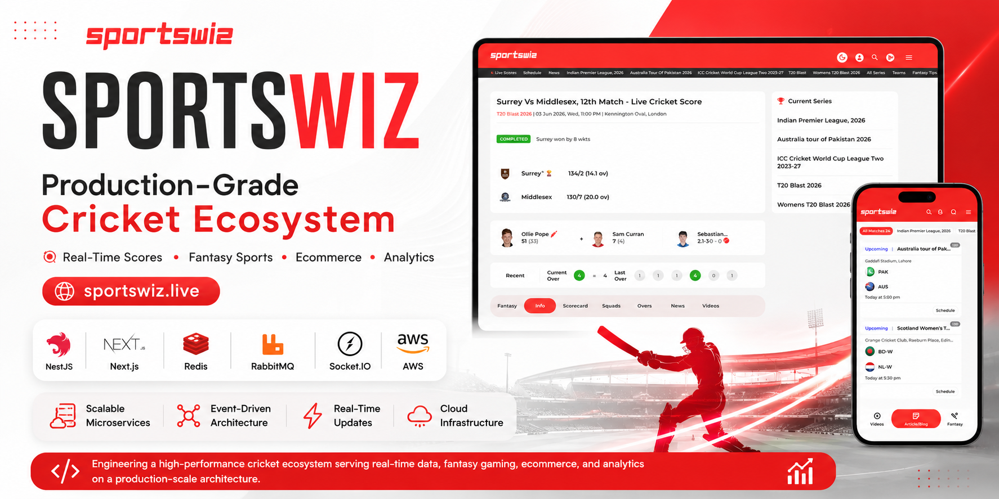
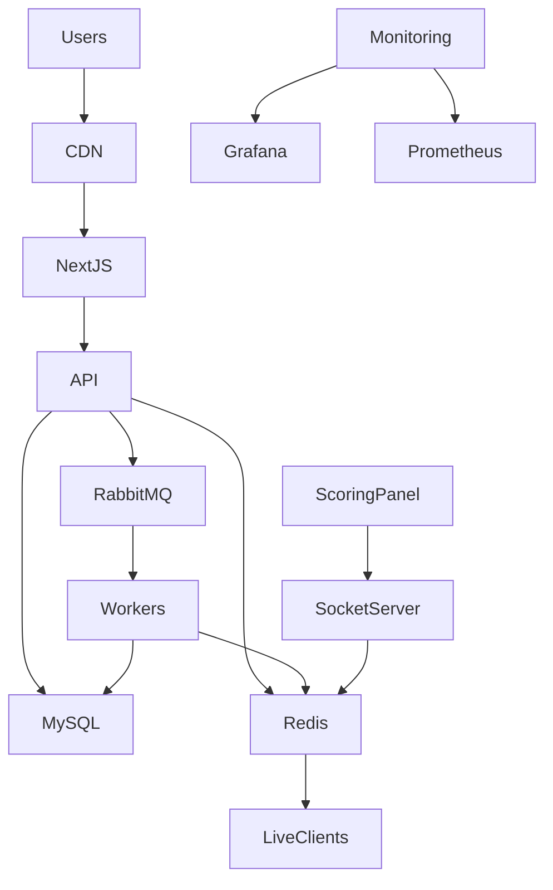

# 🏏 Sportswiz Architecture Case Study

> Production-grade cricket ecosystem architecture, system design, and engineering case study inspired by large-scale sports platforms such as Cricbuzz.

---

## Overview

Sportswiz is a large-scale cricket ecosystem built to provide real-time scoring, player statistics, tournament management, analytics dashboards, fantasy integrations, and live match experiences.

This repository documents the engineering architecture, backend systems, realtime infrastructure, caching strategies, event-driven workflows, and scaling approaches used to support high-volume cricket traffic and live score distribution.

> **Disclaimer**
>
> This repository does not contain proprietary company source code.
>
> The content focuses on architecture, engineering decisions, infrastructure design, and production-grade implementation approaches.

---

# My Role

### Full Stack Engineer

I was responsible for designing and implementing several core platform components including:

* Backend API architecture
* Realtime scoring systems
* Redis caching strategies
* RabbitMQ event workflows
* Database design and optimization
* Admin dashboard development
* Infrastructure planning
* Performance optimization
* Production monitoring

---

# Tech Stack

| Layer          | Technology                      |
| -------------- | ------------------------------- |
| Frontend       | Next.js                         |
| Backend        | NestJS                          |
| Database       | MySQL                           |
| Cache          | Redis                           |
| Message Broker | RabbitMQ                        |
| Realtime       | Socket.IO                       |
| Infrastructure | AWS                             |
| Monitoring     | Grafana, Prometheus, CloudWatch |

---

# Platform Capabilities

## Live Match Center

* Ball-by-ball scoring
* Live score updates
* Match commentary
* Detailed scorecards
* Match statistics

## Tournament Management

* Tournament creation
* Fixtures generation
* Points tables
* Knockout stages

## Player Analytics

* Career statistics
* Batting records
* Bowling records
* Performance trends

## Admin Operations

* Match management
* Team management
* Tournament administration
* User management
* Analytics dashboards

---

# High Level Architecture

---

# Architecture Documents

## Core Architecture

* System Overview
* Backend Architecture
* Realtime Engine
* Caching Strategy
* Event Driven Architecture
* Scaling Strategy

## Database

* Schema Design
* Indexing Strategy
* Query Optimization

## Infrastructure

* AWS Architecture
* Deployment Pipeline
* Monitoring
* Disaster Recovery

## Engineering Challenges

* Realtime Scoring
* Traffic Spikes
* Cache Invalidation
* WebSocket Scaling

---

# Key Engineering Challenges

### Realtime Score Distribution

Delivering score updates to thousands of connected users with minimal latency.

### Cache Consistency

Maintaining synchronization between database records and cached match data.

### High Traffic Events

Handling significant traffic spikes during major tournaments and high-profile matches.

### WebSocket Scalability

Supporting multiple socket servers while maintaining consistent score propagation.

---

# Scalability Goals

* Stateless backend services
* Horizontal API scaling
* Distributed caching
* Queue-based processing
* Event-driven architecture
* Read replica support
* Multi-instance Socket.IO deployment

---

# Future Improvements

* Kubernetes migration
* Multi-region deployment
* Event sourcing
* CQRS architecture
* Kafka integration
* Distributed tracing
* AI-powered analytics

---

# Engineering Takeaways

This project demonstrates practical experience with:

* Production-grade backend architecture
* Realtime distributed systems
* Event-driven workflows
* High-performance caching
* Database optimization
* Infrastructure planning
* Full-stack ownership

---

# License

This repository is intended for educational, portfolio, and architecture demonstration purposes.