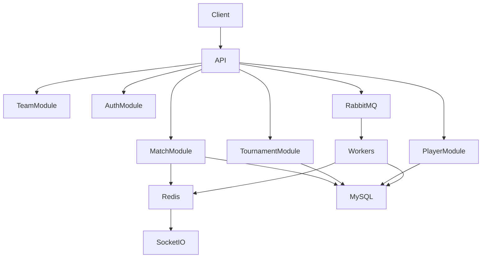

# Backend Architecture

## Overview

The Sportswiz backend is built using NestJS and follows a modular architecture designed for scalability, maintainability, and high-performance data processing.

The backend serves as the central orchestration layer responsible for:

* Business logic execution
* Data persistence
* Realtime event generation
* Cache management
* Queue processing
* Administrative operations

---

# Technology Stack

| Component  | Technology |
| ---------- | ---------- |
| Framework  | NestJS     |
| Language   | TypeScript |
| Database   | MySQL      |
| Cache      | Redis      |
| Messaging  | RabbitMQ   |
| Realtime   | Socket.IO  |
| Deployment | AWS        |

---

# Architectural Goals

The backend architecture was designed around five core goals:

### Scalability

Support increasing traffic without major architectural changes.

### Reliability

Maintain consistent system behavior during failures.

### Performance

Deliver low-latency responses and realtime updates.

### Maintainability

Enable rapid feature development and easier debugging.

### Extensibility

Allow future modules to be added without impacting existing services.

---

# High-Level Architecture



---

# Module Structure

The application is organized into domain-driven modules.

## Auth Module

Responsible for:

* Login
* Registration
* Token Generation
* Authorization
* Role Management

Endpoints:

```text
POST /auth/login
POST /auth/register
GET /auth/profile
```

---

## User Module

Handles:

* User Profiles
* Preferences
* Account Management

---

## Tournament Module

Responsible for:

* Tournament Creation
* Fixture Scheduling
* Tournament Configuration
* Points Tables

Key Entities:

* Tournament
* Group
* Fixture
* Points Table

---

## Team Module

Handles:

* Team Creation
* Squad Management
* Team Statistics

---

## Player Module

Responsible for:

* Player Profiles
* Career Statistics
* Match Performance Records

---

## Match Module

One of the most critical services.

Responsible for:

* Match Creation
* Toss Information
* Innings Management
* Score Calculation
* Match State Tracking

---

## Scoring Module

Provides:

* Ball-by-ball updates
* Extras handling
* Wicket processing
* Over calculations
* Match progression

---

## Analytics Module

Generates:

* Player Rankings
* Team Rankings
* Leaderboards
* Performance Reports

---

# Database Layer

The backend follows a repository-driven data access pattern.

```text
Controller
    ↓
Service
    ↓
Repository
    ↓
MySQL
```

Benefits:

* Clear separation of concerns
* Easier testing
* Better maintainability
* Consistent data access patterns

---

# API Layer

### Responsibilities

* Input validation
* Authentication
* Authorization
* Request processing
* Response transformation

---

# Service Layer

The service layer contains all business logic.

Examples:

### Match Service

Responsibilities:

* Match lifecycle management
* Score calculations
* Match state transitions

### Tournament Service

Responsibilities:

* Tournament workflows
* Scheduling logic
* Points table generation

---

# Caching Layer

Redis is used extensively to reduce database load.

## Cached Data

```text
Live Scores
Match Summaries
Player Statistics
Tournament Standings
Leaderboards
```

Benefits:

* Faster responses
* Reduced database traffic
* Better user experience

---

# Queue Processing Layer

RabbitMQ handles asynchronous workloads.

## Published Events

```text
score.updated
match.started
match.completed
player.stats.updated
leaderboard.updated
notification.created
```

---

# Worker Services

Dedicated worker processes consume queue messages.

Responsibilities:

* Statistics calculation
* Cache refresh
* Notification processing
* Analytics generation

Benefits:

* Reduced API response times
* Better scalability
* Improved reliability

---

# Realtime Layer

Socket.IO powers realtime updates.

Features:

* Match-specific rooms
* Live score updates
* Event broadcasting
* Connection management

---

# Request Lifecycle

## Standard Request

```text
Client
  ↓
API Controller
  ↓
Business Service
  ↓
Redis Check
  ↓
MySQL Query
  ↓
Response
```

---

# Score Update Lifecycle

```text
Scorer
  ↓
API
  ↓
Database Transaction
  ↓
RabbitMQ Event
  ↓
Worker Processing
  ↓
Redis Update
  ↓
Socket Broadcast
  ↓
Connected Users
```

---

# Security Considerations

### Authentication

JWT-based authentication.

### Authorization

Role-based access control.

### Validation

DTO validation using NestJS pipes.

### Rate Limiting

Protection against abuse and excessive API calls.

---

# Performance Optimizations

### Database

* Proper indexing
* Optimized joins
* Query tuning

### Redis

* Cache-first reads
* Selective invalidation
* Hot key management

### RabbitMQ

* Background processing
* Event decoupling
* Retry mechanisms

---

# Reliability Strategies

### Retry Policies

Automatic retries for transient failures.

### Dead Letter Queues

Failed events are isolated for investigation.

### Monitoring

System health is continuously monitored.

### Logging

Structured logging across services.

---

# Engineering Outcomes

The backend architecture enables:

* High throughput
* Low latency
* Horizontal scalability
* Realtime capabilities
* Operational reliability
* Easier maintenance

This foundation allows Sportswiz to support live cricket operations while maintaining a responsive and scalable user experience.
