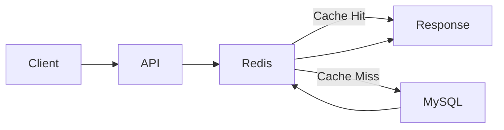
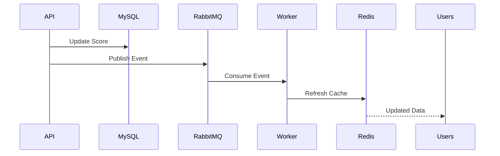

# Redis Caching Strategy

## Overview

Caching plays a critical role in the Sportswiz platform.

Cricket applications are inherently read-heavy systems where thousands of users continuously request live scores, scorecards, player statistics, and tournament standings.

Without an effective caching layer, the database would become a bottleneck during live matches and major tournaments.

Redis was introduced as the primary caching solution to:

* Reduce database load
* Improve API response times
* Support realtime features
* Enable horizontal scalability
* Improve user experience

---

# Why Redis

Redis was selected because of:

### In-Memory Performance

Sub-millisecond read operations.

### Data Structures

Support for:

* Strings
* Hashes
* Sets
* Sorted Sets
* Pub/Sub

### Scalability

Supports clustering and replication.

### Realtime Support

Enables pub/sub communication between services.

---

# Cache Architecture



---

# Cache-First Strategy

The platform follows a cache-first approach.

### Request Flow

1. API receives request.
2. Redis is checked.
3. Cache hit returns data immediately.
4. Cache miss queries MySQL.
5. Response is cached.
6. Response is returned to the user.

Benefits:

* Lower latency
* Reduced database pressure
* Better scalability

---

# Cached Data Categories

## Live Match Data

Most frequently accessed data.

Examples:

```text
match:{id}:score
match:{id}:summary
match:{id}:scorecard
match:{id}:commentary
```

Example:

```text
match:101:score
```

---

## Tournament Data

```text
tournament:{id}
tournament:{id}:points
tournament:{id}:fixtures
```

---

## Team Data

```text
team:{id}
team:{id}:stats
```

---

## Player Data

```text
player:{id}
player:{id}:stats
player:{id}:career
```

---

## Rankings

```text
rankings:batting
rankings:bowling
rankings:allrounder
```

---

## Leaderboards

```text
leaderboard:{contestId}
```

Used heavily in fantasy integrations and tournament analytics.

---

# Cache Key Design

Consistent naming conventions were implemented.

Format:

```text
module:entity:identifier
```

Examples:

```text
match:101:score
match:101:commentary
player:501:stats
team:44:ranking
```

Benefits:

* Easier debugging
* Better maintainability
* Predictable lookups

---

# Time-To-Live (TTL) Strategy

Different datasets have different refresh requirements.

| Data Type            | TTL        |
| -------------------- | ---------- |
| Live Score           | 30 Seconds |
| Commentary           | 30 Seconds |
| Match Summary        | 5 Minutes  |
| Player Statistics    | 15 Minutes |
| Rankings             | 30 Minutes |
| Tournament Standings | 10 Minutes |

---

# Cache Invalidation Strategy

One of the hardest problems in distributed systems is cache invalidation.

The platform uses event-driven invalidation.

---

## Match Score Update

When a scoring event occurs:

1. Database is updated.
2. RabbitMQ event is published.
3. Cache keys are refreshed.
4. Socket updates are broadcast.

Affected keys:

```text
match:101:score
match:101:summary
match:101:scorecard
```

---

## Player Statistics Update

When player stats change:

```text
player:501:stats
player:501:career
```

are invalidated and regenerated.

---

## Tournament Update

When fixtures or standings change:

```text
tournament:22
tournament:22:points
```

are refreshed.

---

# Event-Driven Cache Refresh



Benefits:

* Consistency
* Reduced stale data
* Faster updates

---

# Cache Warming

Frequently accessed data is preloaded into Redis.

Examples:

### Upcoming Matches

```text
upcoming_matches
```

### Active Matches

```text
live_matches
```

### Tournament Standings

```text
popular_tournaments
```

Benefits:

* Reduced cold starts
* Faster first response

---

# Hot Key Management

Some keys receive significantly higher traffic.

Examples:

```text
match:101:score
```

during major tournaments.

Strategies used:

* Efficient payload design
* Short TTLs
* Optimized updates
* Controlled refresh frequency

---

# Redis Data Structures

## Strings

Used for:

* Match summaries
* Score snapshots

---

## Hashes

Used for:

* Player profiles
* Team information

Example:

```text
player:501
```

---

## Sets

Used for:

* Match participants
* Team memberships

---

## Sorted Sets

Used for:

* Rankings
* Leaderboards

Example:

```text
rankings:batting
```

Benefits:

* Fast sorting
* Efficient leaderboard generation

---

# Cache Consistency

Maintaining consistency between Redis and MySQL is critical.

Approach:

1. Database remains source of truth.
2. Cache stores derived data.
3. Events trigger refreshes.
4. TTL acts as fallback protection.

---

# Redis Pub/Sub

Redis also acts as a communication layer.

Used for:

* Socket.IO synchronization
* Cross-instance notifications
* Realtime score propagation

Example:

```text
score.updated
```

---

# Performance Improvements

Before Redis:

```text
Database queried on every request
```

Challenges:

* Higher latency
* Increased database load
* Poor scalability

---

After Redis:

```text
Majority of reads served from cache
```

Results:

* Faster responses
* Lower database utilization
* Better user experience

---

# Failure Handling

## Redis Restart

System falls back to database reads.

---

## Cache Misses

Automatic regeneration from MySQL.

---

## Stale Data

TTL expiration ensures eventual consistency.

---

# Monitoring Metrics

Important Redis metrics include:

### Cache Metrics

* Cache Hit Ratio
* Cache Miss Ratio
* Key Growth

### Resource Metrics

* Memory Usage
* CPU Utilization

### Performance Metrics

* Command Latency
* Evictions
* Expired Keys

---

# Scaling Redis

As traffic grows:

### Vertical Scaling

Increase memory and CPU resources.

### Replication

Deploy read replicas.

### Clustering

Distribute data across multiple Redis nodes.

### Pub/Sub Scaling

Support larger realtime workloads.

---

# Engineering Outcome

Redis became a foundational component of the platform by:

* Reducing database traffic
* Improving response times
* Supporting realtime features
* Enabling horizontal scalability
* Enhancing overall system reliability

The caching layer significantly improved platform performance during live matches and high-traffic tournaments.
