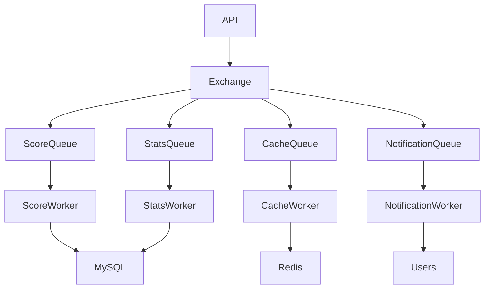
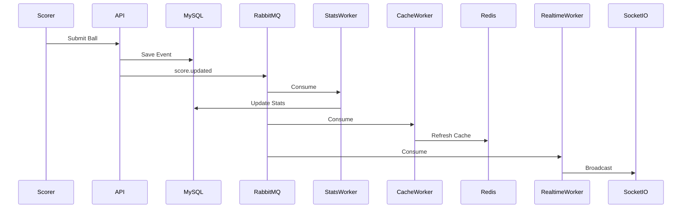

# Event-Driven Architecture

## Overview

Sportswiz utilizes an event-driven architecture to decouple services, improve scalability, reduce API response times, and support asynchronous processing.

Instead of performing all operations within a single API request lifecycle, non-critical workloads are delegated to background workers through RabbitMQ.

This approach enables the platform to handle high traffic volumes while maintaining fast response times.

---

# Why Event-Driven Architecture

Traditional synchronous systems can become bottlenecks when multiple operations must be executed during a single request.

Example:

When a score update occurs, the system may need to:

* Save score data
* Update player statistics
* Update team statistics
* Refresh rankings
* Refresh caches
* Generate notifications
* Broadcast live updates

Performing all these operations synchronously increases latency significantly.

---

# Solution

RabbitMQ was introduced as an asynchronous messaging layer.

The API performs only critical operations and publishes events for downstream processing.

Benefits:

* Faster API responses
* Better fault isolation
* Horizontal scalability
* Easier service expansion

---

# Architecture Overview



---

# RabbitMQ Components

## Producers

Producers publish events.

Examples:

* Match Service
* Tournament Service
* Analytics Service
* Notification Service

---

## Exchanges

Exchanges route messages to appropriate queues.

Sportswiz primarily uses:

### Topic Exchange

Allows flexible routing.

Example:

```text
score.*
match.*
player.*
notification.*
```

---

## Queues

Queues store messages until consumers process them.

Examples:

```text
score_updates
player_stats
cache_refresh
notifications
analytics
```

---

## Consumers

Workers consume events from queues.

Each worker owns a specific responsibility.

Benefits:

* Independent scaling
* Better isolation
* Improved reliability

---

# Event Categories

The platform emits several categories of events.

---

## Match Events

Examples:

```text
match.created
match.started
match.completed
match.abandoned
```

Purpose:

* Update match state
* Notify users
* Trigger analytics

---

## Scoring Events

Examples:

```text
score.updated
over.completed
innings.completed
wicket.fallen
```

Purpose:

* Refresh scorecards
* Update statistics
* Broadcast updates

---

## Tournament Events

Examples:

```text
tournament.created
fixture.generated
points.updated
```

Purpose:

* Refresh standings
* Update dashboards

---

## Player Events

Examples:

```text
player.stats.updated
player.ranking.updated
```

Purpose:

* Refresh player profiles
* Update rankings

---

## Notification Events

Examples:

```text
notification.created
notification.sent
```

Purpose:

* User communication
* Match alerts

---

# Score Update Flow

One of the most important event flows.



---

# Statistics Processing

Player statistics are processed asynchronously.

Examples:

### Batting

* Runs
* Strike Rate
* Boundaries
* Averages

### Bowling

* Wickets
* Economy
* Dot Balls

### Fielding

* Catches
* Run Outs
* Stumpings

Benefits:

* Reduced API latency
* Better scalability

---

# Cache Refresh Events

Cache refresh operations are delegated to workers.

Examples:

```text
cache.match.refresh
cache.player.refresh
cache.tournament.refresh
```

Benefits:

* Consistent data
* Reduced cache staleness

---

# Notification Processing

Notifications are generated asynchronously.

Examples:

### Match Started

```text
India vs Australia has started.
```

### Wicket Event

```text
Virat Kohli has been dismissed.
```

### Match Completed

```text
India won by 7 wickets.
```

Benefits:

* Faster APIs
* Better user engagement

---

# Analytics Processing

Heavy calculations are performed in the background.

Examples:

* Rankings
* Leaderboards
* Tournament reports
* Player comparisons

Benefits:

* Reduced database pressure
* Better system responsiveness

---

# Worker Architecture

Workers are independently deployable services.

Example:

```text
Score Worker
Stats Worker
Cache Worker
Analytics Worker
Notification Worker
```

Advantages:

* Independent scaling
* Better fault isolation
* Easier maintenance

---

# Retry Strategy

Failures are inevitable in distributed systems.

RabbitMQ supports automatic retries.

Example:

```text
Attempt 1
Attempt 2
Attempt 3
Move to Dead Letter Queue
```

Benefits:

* Increased reliability
* Reduced message loss

---

# Dead Letter Queues (DLQ)

Failed messages are redirected to dedicated queues.

Examples:

```text
score_updates_dlq
notifications_dlq
analytics_dlq
```

Used for:

* Debugging
* Recovery
* Incident investigation

---

# Idempotency

Workers are designed to safely process duplicate messages.

Example:

If:

```text
score.updated
```

is delivered twice,

the resulting database state remains correct.

Benefits:

* Safe retries
* Reliable processing

---

# Event Naming Convention

Consistent naming conventions improve maintainability.

Format:

```text
entity.action
```

Examples:

```text
match.started
match.completed
score.updated
player.stats.updated
notification.created
```

---

# Monitoring

RabbitMQ metrics are continuously monitored.

Key Metrics:

### Queue Depth

Number of pending messages.

### Consumer Throughput

Messages processed per second.

### Retry Count

Failed message attempts.

### Processing Latency

Time from publish to completion.

---

# Scaling Strategy

RabbitMQ scales horizontally.

### More Producers

Additional API instances can publish events.

### More Consumers

Additional workers can consume events.

### Queue Partitioning

High-volume workloads can be separated.

Example:

```text
score_updates
analytics
notifications
```

Benefits:

* Better throughput
* Improved fault isolation

---

# Failure Handling

## Consumer Crash

Messages remain in queue.

Another worker continues processing.

---

## Worker Downtime

RabbitMQ retains unprocessed messages.

No data loss occurs.

---

## Temporary Database Failure

Retry mechanisms handle transient issues.

---

# Engineering Outcomes

The event-driven architecture enabled:

* Faster API responses
* Decoupled services
* Better scalability
* Improved reliability
* Easier feature expansion
* Reduced operational complexity

By introducing RabbitMQ as the asynchronous backbone, Sportswiz was able to process realtime cricket events efficiently while maintaining a responsive user experience at scale.
