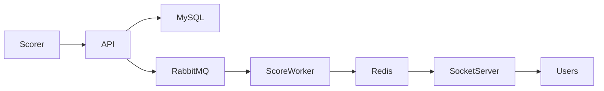
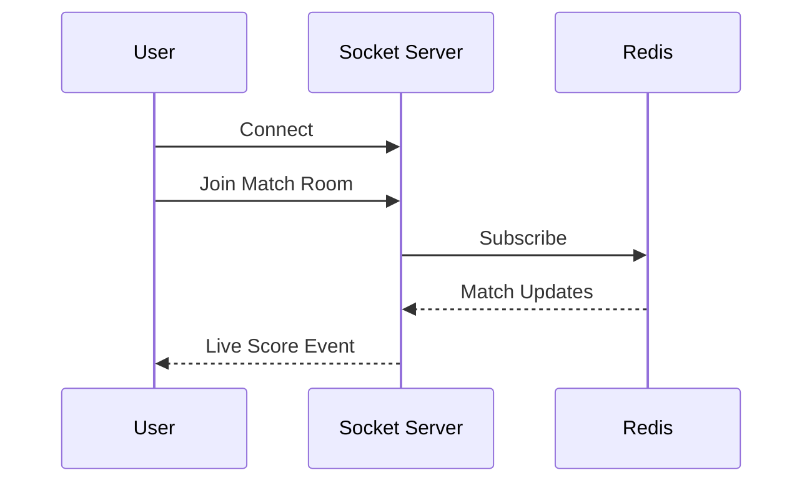
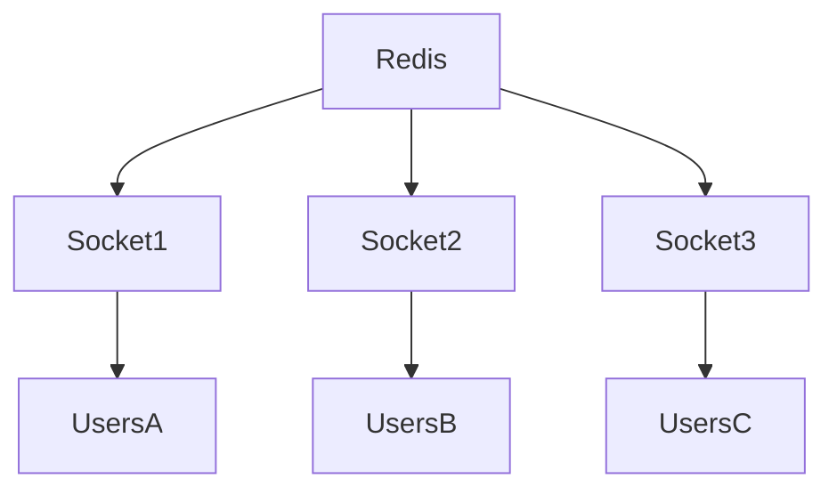

# Realtime Scoring Engine

## Overview

The Realtime Scoring Engine is one of the most critical components of the Sportswiz platform.

Its primary responsibility is to deliver live cricket score updates to connected users with minimal latency while maintaining consistency across multiple application servers.

The system was designed to support:

* Ball-by-ball score updates
* Match commentary
* Scorecard updates
* Statistics updates
* Live notifications
* Concurrent user sessions

---

# Objectives

The realtime system was built around several key goals:

### Low Latency

Users should receive score updates within milliseconds after a scoring event occurs.

### High Availability

Realtime services should remain operational during traffic spikes and server failures.

### Horizontal Scalability

Additional servers should be added without major architectural changes.

### Event Consistency

All users should observe the same match state regardless of which server they are connected to.

---

# Technology Stack

| Component              | Technology |
| ---------------------- | ---------- |
| Realtime Communication | Socket.IO  |
| Pub/Sub Layer          | Redis      |
| Backend Services       | NestJS     |
| Persistence            | MySQL      |
| Event Processing       | RabbitMQ   |

---

# High-Level Architecture



---

# Match Update Lifecycle

A single ball event follows the lifecycle below.

### Step 1

Scorer enters ball information.

Example:

```text
4 Runs
```

---

### Step 2

NestJS API validates the scoring event.

Validation includes:

* Match Status
* Innings Status
* Player Validation
* Ball Legality

---

### Step 3

Score data is persisted to MySQL.

Tables updated:

```text
balls
scorecards
innings
player_stats
```

---

### Step 4

A scoring event is published to RabbitMQ.

Example Event:

```json
{
  "event": "score.updated",
  "matchId": 101,
  "runs": 4
}
```

---

### Step 5

Worker processes consume the event.

Responsibilities:

* Calculate statistics
* Update leaderboards
* Refresh cache
* Generate notifications

---

### Step 6

Redis cache is updated.

Example Keys:

```text
match:101:score
match:101:summary
match:101:commentary
```

---

### Step 7

Socket.IO broadcasts updates.

Connected users receive updated information immediately.

---

# Socket.IO Architecture

The platform uses room-based broadcasting.

Benefits:

* Efficient message delivery
* Reduced bandwidth consumption
* Better scalability

---

## Match Rooms

Each match has a dedicated room.

Example:

```text
match_101
match_102
match_103
```

---

## User Subscription Flow



---

# Broadcast Events

The system emits various realtime events.

## Score Updates

```text
score.updated
```

---

## Commentary Updates

```text
commentary.updated
```

---

## Match Status Changes

```text
match.started
match.completed
innings.started
innings.completed
```

---

## Statistics Updates

```text
player.stats.updated
leaderboard.updated
```

---

# Redis Pub/Sub Layer

Redis acts as a communication bridge between multiple Socket.IO instances.

Without Redis:

```text
Server A users receive update
Server B users miss update
```

With Redis:

```text
All servers receive update
All users stay synchronized
```

---

# Multi-Server Deployment

As traffic grows, multiple Socket.IO servers are deployed.



---

# Connection Management

The system tracks:

* Active users
* Match subscriptions
* Session identifiers
* Connection health

---

# Reconnection Strategy

Unexpected disconnections are handled automatically.

Process:

1. User reconnects.
2. Previous session is restored.
3. Latest match state is fetched.
4. Missed updates are synchronized.

Benefits:

* Better user experience
* Reduced data inconsistency
* Seamless recovery

---

# Performance Optimizations

## Room-Based Broadcasting

Only interested users receive updates.

---

## Payload Optimization

Broadcasts contain minimal required data.

Example:

```json
{
  "matchId": 101,
  "score": "145/4",
  "over": "17.2"
}
```

Instead of transmitting full scorecards.

---

## Redis Caching

Frequently accessed match data is served directly from cache.

---

## Event Batching

High-frequency events can be grouped before broadcasting.

Benefits:

* Lower network overhead
* Reduced server load

---

# Failure Handling

## Socket Server Failure

Users reconnect to healthy instances.

---

## Redis Failure

Fallback mechanisms retrieve latest state from database.

---

## Worker Failure

RabbitMQ retains events until successfully processed.

---

# Monitoring Metrics

The realtime infrastructure monitors:

### Connection Metrics

* Active Connections
* Connections Per Match
* Connection Growth Rate

### Event Metrics

* Events Per Second
* Broadcast Latency
* Failed Broadcasts

### Infrastructure Metrics

* Redis Memory Usage
* Socket Server CPU Usage
* Queue Backlog

---

# Scaling Strategy

The realtime architecture scales through:

### Horizontal Socket Servers

Additional instances can be deployed during tournaments.

### Redis Adapter

Synchronizes events across servers.

### Queue-Based Processing

Heavy workloads are moved to background workers.

### Stateless Services

Application instances remain independent.

---

# Engineering Challenges

## Challenge

Thousands of users joining a match simultaneously.

### Solution

* Socket rooms
* Redis pub/sub
* Horizontal scaling
* Connection pooling

---

## Challenge

Maintaining score consistency across servers.

### Solution

* Redis adapter
* Centralized cache updates
* Event-driven synchronization

---

# Outcome

The realtime architecture provides:

* Low-latency score delivery
* High availability
* Efficient resource utilization
* Horizontal scalability
* Reliable match synchronization

This design enables Sportswiz to support live cricket experiences at production scale while maintaining a responsive user experience.
