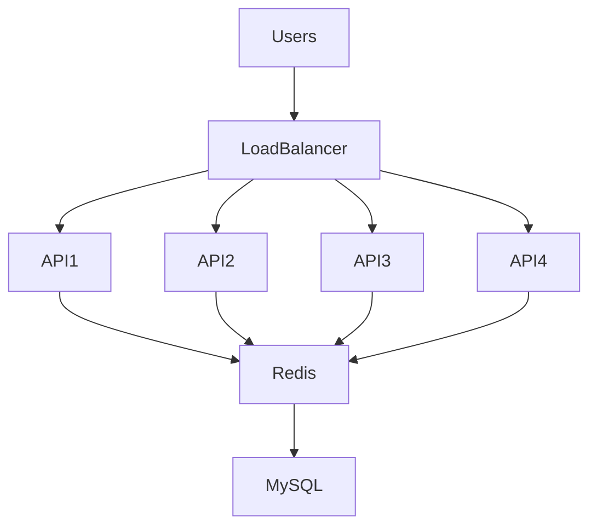
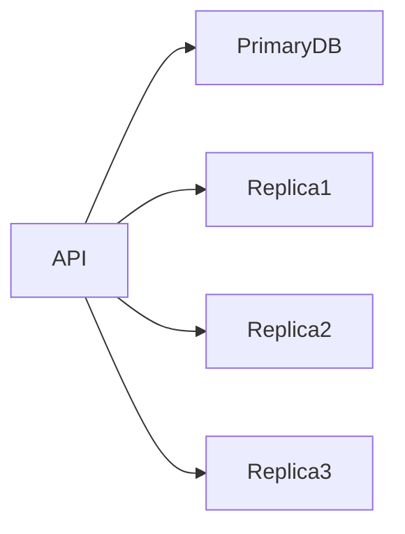
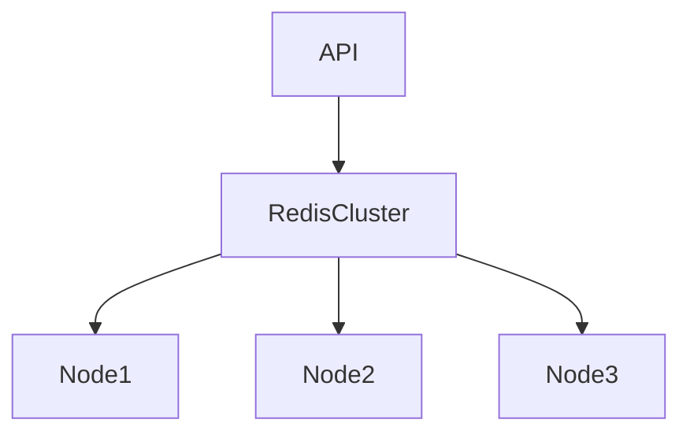
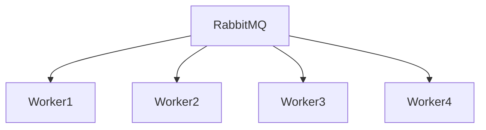
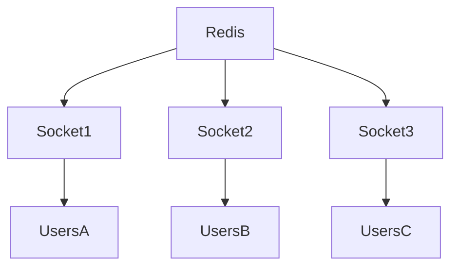

# Scaling Strategy

## Overview

One of the primary goals of Sportswiz was to support traffic growth without requiring major architectural redesigns.

Cricket platforms experience highly unpredictable traffic patterns.

Normal days may generate moderate traffic, while major tournaments, playoffs, or finals can increase platform load dramatically within minutes.

The architecture was therefore designed with scalability as a core principle from the beginning.

---

# Scaling Objectives

The platform was designed to achieve:

* High availability
* Low latency
* Horizontal scalability
* Fault tolerance
* Operational simplicity

---

# Traffic Characteristics

Sports platforms have unique traffic patterns.

### Read Heavy Workloads

The majority of requests are:

* Live scores
* Scorecards
* Match summaries
* Player statistics
* Rankings

Typical ratio:

```text
Read Requests: 95%
Write Requests: 5%
```

---

### Burst Traffic

Traffic spikes occur during:

* IPL Matches
* World Cup Matches
* Tournament Finals
* Match Winning Moments

Traffic can increase several times within minutes.

---

# Scaling Philosophy

The platform follows several principles:

### Stateless Services

Application servers do not store user state.

Benefits:

* Easy horizontal scaling
* Faster deployments
* Better fault tolerance

---

### Cache First

Most reads should be served from Redis.

Benefits:

* Reduced database load
* Faster response times

---

### Async Processing

Heavy workloads should not block API requests.

Benefits:

* Faster APIs
* Better throughput

---

### Event Driven Architecture

Services communicate through events.

Benefits:

* Loose coupling
* Independent scaling

---

# Application Layer Scaling

NestJS APIs are horizontally scalable.

## Initial Deployment

```text
1 API Instance
```

---

## Production Deployment

```text
Load Balancer

 ├── API Instance 1
 ├── API Instance 2
 ├── API Instance 3
 └── API Instance N
```

---

# API Scaling Architecture



---

# Load Balancing

A load balancer distributes incoming requests.

Responsibilities:

* Traffic distribution
* Health checks
* Failover routing
* SSL termination

Benefits:

* Better availability
* Improved performance

---

# Database Scaling

MySQL remains the system of record.

As traffic increases, database scaling becomes critical.

---

## Primary Database

Handles:

* Inserts
* Updates
* Deletes

Example:

```text
Match Updates
Player Statistics
Tournament Operations
```

---

## Read Replicas

Used for:

* Scorecards
* Rankings
* Analytics
* Reports

Architecture:



Benefits:

* Reduced primary load
* Better read throughput

---

# Query Optimization

Database performance is improved through:

### Indexing

Common indexes:

```text
match_id
player_id
team_id
tournament_id
status
```

---

### Pagination

Large datasets are never fully loaded.

---

### Optimized Joins

Queries are designed to minimize expensive operations.

---

# Redis Scaling

Redis is one of the most important scaling components.

Without Redis, database load becomes unsustainable during live matches.

---

# Redis Responsibilities

Used for:

* Live scores
* Match summaries
* Commentary
* Rankings
* Leaderboards

---

# Redis Scaling Architecture



Benefits:

* Higher throughput
* Better reliability
* Fault tolerance

---

# Redis Replication

Replica nodes provide:

* High availability
* Faster reads
* Improved resilience

---

# Hot Key Strategy

Popular matches generate extremely high traffic.

Example:

```text
match:101:score
```

Mitigation strategies:

* Efficient payloads
* Controlled refresh rates
* Cache segmentation
* Monitoring hot keys

---

# RabbitMQ Scaling

Asynchronous workloads scale independently.

Examples:

* Statistics Processing
* Notifications
* Cache Refreshes
* Analytics

---

# Queue Scaling Model



Benefits:

* Increased throughput
* Parallel processing
* Better fault tolerance

---

# Worker Autoscaling

Additional consumers can be added during:

* Major tournaments
* High scoring matches
* Analytics workloads

---

# Socket.IO Scaling

Realtime updates require specialized scaling.

---

# Challenge

Users may connect to different application instances.

Without synchronization:

```text
User A receives update
User B misses update
```

---

# Solution

Redis Adapter

Architecture:



Benefits:

* Consistent updates
* Cross-instance synchronization
* Horizontal scaling

---

# CDN Strategy

Static assets are distributed through CDN.

Examples:

* Images
* JavaScript
* CSS
* Media Files

Benefits:

* Reduced latency
* Lower server load
* Improved performance

---

# AWS Scaling Strategy

The platform is designed around elastic infrastructure.

---

## Auto Scaling

Additional instances are provisioned automatically.

Triggers:

* CPU Usage
* Memory Usage
* Request Volume

---

## Load Balancer

Distributes traffic across healthy instances.

---

## CloudFront CDN

Improves asset delivery globally.

---

## Managed Services

Used where appropriate to reduce operational overhead.

---

# Monitoring Driven Scaling

Scaling decisions are based on metrics.

Key indicators:

### API Metrics

* Requests Per Second
* Response Time
* Error Rate

---

### Database Metrics

* Query Time
* Connections
* Replication Lag

---

### Redis Metrics

* Memory Usage
* Hit Ratio
* Command Latency

---

### RabbitMQ Metrics

* Queue Length
* Consumer Throughput
* Retry Count

---

### Socket Metrics

* Active Connections
* Events Per Second
* Broadcast Latency

---

# Capacity Planning

Traffic forecasts are used to estimate:

* API capacity
* Database requirements
* Redis memory
* Queue throughput
* Socket server limits

This allows infrastructure to be provisioned proactively.

---

# Failure Scenarios

## API Instance Failure

Load balancer redirects traffic.

---

## Worker Failure

RabbitMQ retains messages.

---

## Redis Failure

Database fallback mechanisms activate.

---

## Database Replica Failure

Traffic shifts to healthy replicas.

---

# Future Scaling Opportunities

Potential future improvements include:

### Kubernetes

Container orchestration and automated scaling.

---

### Multi-Region Deployment

Geographic redundancy.

---

### Kafka Migration

For extremely high-volume event streaming.

---

### Event Sourcing

Improved auditability and replayability.

---

### CQRS

Further separation of reads and writes.

---

# Engineering Outcomes

The scaling strategy enables Sportswiz to:

* Support large concurrent audiences
* Deliver low-latency score updates
* Maintain operational reliability
* Handle traffic spikes efficiently
* Scale horizontally with minimal effort

The architecture ensures the platform can continue growing without requiring significant redesigns while maintaining a responsive and reliable user experience.
