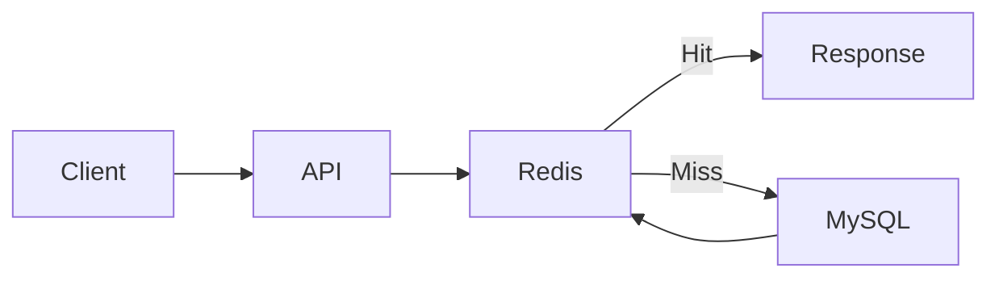
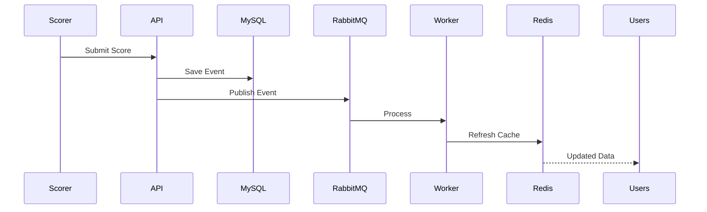

# Engineering Challenge: Cache Invalidation

## Overview

One of the most difficult engineering challenges encountered while building Sportswiz was maintaining cache consistency across a distributed system.

The platform relies heavily on Redis to support realtime score updates, player statistics, rankings, tournament standings, and high-volume read traffic.

While caching dramatically improves performance, it introduces a new challenge:

> How do you ensure users always see accurate data while still benefiting from caching?

This document explores the challenges, solutions, trade-offs, and architectural decisions behind cache invalidation within Sportswiz.

---

# Why Caching Was Critical

Sports platforms are heavily read-oriented.

Typical user actions include:

```text
Live Scores
Scorecards
Player Profiles
Rankings
Points Tables
Match Commentary
```

Without caching:

```text
Every Request
      ↓
MySQL
```

This creates excessive database load.

---

## Redis Solution



Benefits:

* Faster response times
* Reduced database load
* Better scalability

---

# The Core Problem

Imagine the following scenario:

### Before Update

```text
Match Score

145/4
```

Cached in Redis.

---

### New Ball Event

```text
4 Runs
```

Actual score becomes:

```text
149/4
```

---

### Problem

Redis still contains:

```text
145/4
```

Users see stale data.

---

# Why Cache Invalidation Is Difficult

Distributed systems contain multiple moving parts.

Example:

```text
API Servers

Redis

RabbitMQ

Workers

Socket Servers

MySQL
```

All components must remain synchronized.

---

# Challenge #1

## Stale Match Scores

### Problem

Live scores change constantly.

Examples:

```text
Runs
Wickets
Extras
Overs
```

A score cached a few seconds ago may already be outdated.

---

## Solution

Event-driven cache refresh.

Flow:



Benefits:

* Immediate cache updates
* Reduced stale data

---

# Challenge #2

## Multiple Related Cache Keys

A single scoring event affects multiple caches.

Example:

```text
match:101:score

match:101:summary

match:101:scorecard

player:501:stats

team:22:stats
```

Updating only one key creates inconsistencies.

---

## Solution

Grouped invalidation strategy.

Example:

```text
score.updated
```

triggers refresh of all affected keys.

Benefits:

* Consistent views
* Reduced synchronization issues

---

# Challenge #3

## Player Statistics Consistency

### Problem

A boundary affects:

```text
Runs

Strike Rate

Average

Career Statistics
```

Multiple caches depend on the same event.

---

## Solution

Dedicated statistics worker.

Flow:

```text
Score Event
      ↓
Stats Worker
      ↓
Update Database
      ↓
Refresh Player Cache
```

Benefits:

* Centralized processing
* Consistent calculations

---

# Challenge #4

## Tournament Standings

### Problem

Match completion affects:

```text
Points Table

Net Run Rate

Team Rankings
```

Cached standings may become outdated.

---

## Solution

Event-driven recalculation.

Example:

```text
match.completed
```

Triggers:

```text
points.refresh

rankings.refresh
```

Benefits:

* Accurate standings
* Better user trust

---

# Cache Invalidation Approaches Considered

Several approaches were evaluated.

---

## Strategy 1

### Time-Based Expiration

Example:

```text
TTL = 5 Minutes
```

Benefits:

* Easy implementation

Problems:

* Stale data possible

---

## Strategy 2

### Manual Cache Refresh

Update cache whenever data changes.

Benefits:

* Accurate data

Problems:

* Difficult to maintain

---

## Strategy 3

### Event-Driven Refresh

Chosen approach.

Benefits:

* Scalable
* Reliable
* Automated

---

# Cache Key Structure

Consistent naming conventions simplify invalidation.

Format:

```text
module:id:type
```

Examples:

```text
match:101:score

match:101:commentary

player:501:stats

team:22:ranking
```

Benefits:

* Easier management
* Predictable operations

---

# TTL Strategy

TTL acts as a safety mechanism.

---

## Live Match Data

```text
30 Seconds
```

---

## Commentary

```text
30 Seconds
```

---

## Match Summary

```text
5 Minutes
```

---

## Player Statistics

```text
15 Minutes
```

---

## Rankings

```text
30 Minutes
```

Benefits:

* Automatic cleanup
* Reduced stale data risk

---

# Challenge #5

## Race Conditions

### Problem

Multiple updates arriving simultaneously.

Example:

```text
Ball 1

Ball 2

Ball 3
```

Workers may process updates out of order.

Potential result:

```text
Incorrect Cache State
```

---

## Solution

Sequential event processing.

Each event contains:

```text
matchId

overNumber

ballNumber

timestamp
```

Benefits:

* Deterministic updates
* Consistent cache state

---

# Challenge #6

## Cache Stampede

### Problem

Popular cache key expires.

Example:

```text
match:101:score
```

Thousands of requests arrive simultaneously.

All requests hit database.

Result:

```text
Database Spike
```

---

## Solution

Cache warming.

Frequently accessed data is proactively refreshed.

Examples:

```text
Live Matches

Popular Tournaments

Rankings
```

Benefits:

* Reduced database pressure
* Faster responses

---

# Challenge #7

## Hot Keys

Popular matches generate extreme traffic.

Example:

```text
India vs Australia Final
```

Key:

```text
match:101:score
```

receives massive traffic.

---

## Solution

Optimized payload design.

Example:

Instead of:

```json
{
  "fullScorecard": {}
}
```

Return:

```json
{
  "score": "149/4",
  "overs": "17.2"
}
```

Benefits:

* Smaller payloads
* Better throughput

---

# Cache Consistency Model

The platform follows:

```text
Database
      ↓
Source Of Truth
```

Redis stores:

```text
Derived Data
```

Benefits:

* Clear ownership
* Easier recovery

---

# Failure Scenario

## Redis Restart

Problem:

```text
Cache Lost
```

---

## Recovery

```text
Application
      ↓
Cache Miss
      ↓
Database Query
      ↓
Repopulate Cache
```

Benefits:

* Self-healing behavior

---

# Monitoring Cache Health

Several metrics are monitored.

---

## Cache Hit Ratio

Measures cache effectiveness.

Target:

```text
> 90%
```

---

## Cache Miss Ratio

Detects inefficiencies.

---

## Memory Usage

Prevents resource exhaustion.

---

## Key Growth

Monitors cache expansion.

---

## Command Latency

Detects Redis performance issues.

---

# Event-Driven Invalidation Flow

```mermaid
flowchart TD

Database Update

Database Update --> Event

Event --> RabbitMQ

RabbitMQ --> Worker

Worker --> Redis

Redis --> Users
```

Benefits:

* Reliable propagation
* Consistent cache state

---

# Lessons Learned

Several important lessons emerged.

---

## Caching Is Easy

Keeping caches correct is difficult.

---

## Database Must Remain Source Of Truth

Never rely exclusively on cache.

---

## TTL Is Not Enough

Event-driven updates are required.

---

## Monitoring Is Essential

Cache problems are often invisible until users report them.

---

## Simplicity Matters

Predictable cache structures simplify operations.

---

# Engineering Outcome

The cache invalidation strategy enabled Sportswiz to:

* Deliver fast responses
* Maintain score accuracy
* Support realtime updates
* Reduce database load
* Scale during major tournaments

By combining Redis caching, event-driven refreshes, TTL safeguards, and monitoring, the platform achieved a balance between performance and consistency while supporting a large-scale realtime cricket ecosystem.
