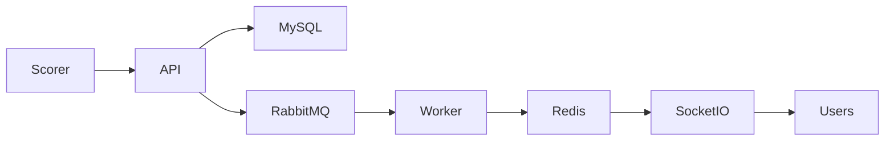
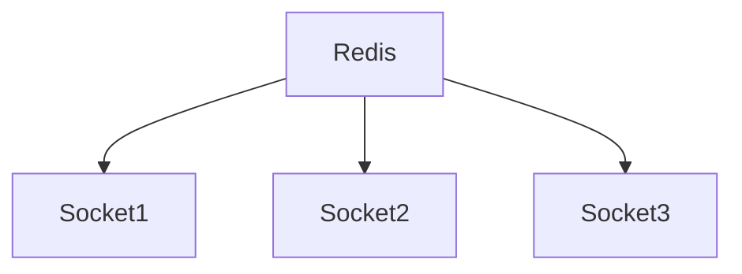
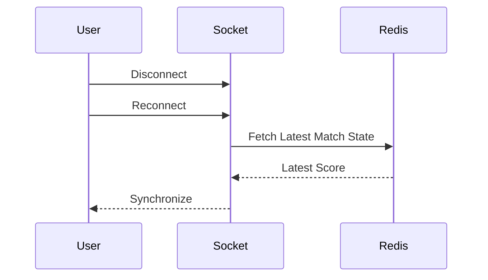
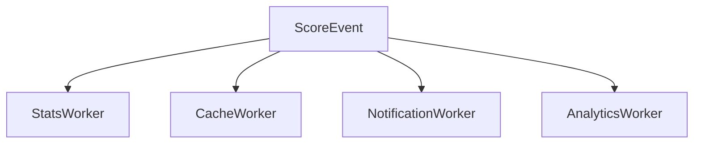

# Engineering Challenge: Realtime Scoring System

## Overview

One of the most technically demanding components of Sportswiz was the realtime scoring engine.

Cricket users expect score updates to appear almost instantly after every ball. Any noticeable delay, inconsistency, or incorrect score can significantly impact user trust and platform reliability.

Unlike traditional CRUD systems, realtime sports platforms require continuous synchronization between scorers, backend systems, caches, databases, queues, and thousands of connected users.

This document describes the challenges encountered while designing and scaling the realtime scoring architecture.

---

# Problem Statement

The platform needed to support:

* Ball-by-ball scoring
* Instant score updates
* Thousands of concurrent users
* Multiple active matches
* Consistent match state
* Reliable event delivery

while maintaining low latency and high availability.

---

# Realtime Architecture Overview



---

# Challenge #1

## Low-Latency Score Delivery

### Problem

When a scorer submits a ball event:

```text id="1a3b4c"
4 Runs
```

users expect the update immediately.

A traditional polling-based system introduces delays and excessive API traffic.

Example:

```text id="5d6e7f"
User Refreshes Every 10 Seconds
```

Problems:

* Delayed updates
* Increased server load
* Poor user experience

---

## Solution

Socket.IO was introduced for realtime communication.

Flow:

```text id="8g9h0i"
Ball Submitted
      ↓
Database Updated
      ↓
Redis Updated
      ↓
Socket Event Broadcast
      ↓
Users Receive Update
```

Benefits:

* Near realtime delivery
* Reduced polling
* Lower API traffic

---

# Challenge #2

## Consistency Across Multiple Servers

### Problem

As traffic increased, multiple Socket.IO servers were deployed.

Example:

```text id="j1k2l3"
Socket Server A
Socket Server B
Socket Server C
```

Without synchronization:

```text id="m4n5o6"
User A sees updated score

User B sees stale score
```

This creates inconsistent user experiences.

---

## Solution

Redis Pub/Sub was introduced.

Architecture:



Process:

1. Worker publishes update.
2. Redis broadcasts event.
3. All socket servers receive update.
4. All connected users remain synchronized.

Benefits:

* Consistent match state
* Horizontal scalability
* Reliable propagation

---

# Challenge #3

## Event Ordering

### Problem

Cricket scoring is sequential.

Example:

```text id="p7q8r9"
Ball 1
Ball 2
Ball 3
```

Events must arrive in the correct order.

Incorrect ordering may result in:

```text id="s0t1u2"
145/4

Then

141/4
```

which creates score inconsistencies.

---

## Solution

Every scoring event receives:

### Match Identifier

```text id="v3w4x5"
matchId
```

### Over Number

```text id="y6z7a8"
overNumber
```

### Ball Number

```text id="b9c0d1"
ballNumber
```

Workers process events in sequence.

Benefits:

* Correct score progression
* Reliable match state

---

# Challenge #4

## Database Bottlenecks

### Problem

Every score update generates writes.

Examples:

```text id="e2f3g4"
balls
scorecards
player_stats
innings
```

During busy tournaments, database load increases significantly.

---

## Solution

Redis caching and asynchronous processing.

Flow:

```text id="h5i6j7"
Write to Database
      ↓
Publish Event
      ↓
Worker Updates Cache
      ↓
Users Read From Redis
```

Benefits:

* Reduced database reads
* Faster responses
* Better scalability

---

# Challenge #5

## Thousands of Concurrent Connections

### Problem

A popular match may attract thousands of connected users simultaneously.

Challenges:

* Connection management
* Resource consumption
* Broadcast efficiency

---

## Solution

Socket Rooms

Each match receives a dedicated room.

Example:

```text id="k8l9m0"
match_101
match_102
match_103
```

Users only receive updates for matches they follow.

Benefits:

* Reduced bandwidth
* Lower server load
* Efficient broadcasting

---

# Challenge #6

## Reconnection Handling

### Problem

Mobile users frequently disconnect.

Reasons:

```text id="n1o2p3"
Network Change
Signal Loss
Application Backgrounding
```

Without recovery:

Users miss score updates.

---

## Solution

Automatic Reconnection

Flow:



Benefits:

* Better user experience
* Reduced inconsistency

---

# Challenge #7

## Duplicate Events

### Problem

Retries can occasionally create duplicate events.

Example:

```text id="q4r5s6"
score.updated
score.updated
```

Potential issues:

* Duplicate runs
* Incorrect statistics

---

## Solution

Idempotent Event Processing

Every scoring event receives:

```text id="t7u8v9"
eventId
```

Workers ignore previously processed events.

Benefits:

* Safe retries
* Accurate statistics

---

# Challenge #8

## Realtime Statistics Updates

### Problem

A single ball can impact:

```text id="w0x1y2"
Scorecard
Player Stats
Team Stats
Rankings
Leaderboards
```

Performing all calculations synchronously increases latency.

---

## Solution

RabbitMQ Event Processing

Architecture:



Benefits:

* Faster API responses
* Independent scaling

---

# Challenge #9

## Traffic Spikes During Major Matches

### Problem

Traffic can increase dramatically during:

```text id="z3a4b5"
IPL Finals
World Cup Matches
Last Over Finishes
```

Challenges:

* API saturation
* Cache pressure
* Socket load

---

## Solution

Horizontal Scaling

Components scaled:

### API Instances

```text id="c6d7e8"
API 1
API 2
API 3
API N
```

### Socket Servers

```text id="f9g0h1"
Socket 1
Socket 2
Socket 3
```

### Workers

```text id="i2j3k4"
Worker Pool
```

Benefits:

* Increased capacity
* Better fault tolerance

---

# Performance Results

The final architecture achieved:

### Fast Delivery

Score updates distributed within milliseconds.

---

### Scalability

Support for large concurrent audiences.

---

### Reliability

Consistent score propagation.

---

### Availability

Realtime services remained operational during traffic spikes.

---

# Lessons Learned

Several important engineering lessons emerged:

### Realtime Systems Are Distributed Systems

Consistency becomes more important than raw speed.

---

### Event Ordering Matters

Correct sequencing is critical for sports platforms.

---

### Caching Is Essential

Realtime systems quickly overwhelm databases without caching.

---

### Asynchronous Processing Scales Better

Heavy workloads should be moved away from API requests.

---

### Monitoring Is Non-Negotiable

Realtime infrastructure requires continuous visibility.

---

# Engineering Outcome

The realtime scoring engine became one of the most critical and technically sophisticated parts of the Sportswiz platform.

Through the use of:

* Socket.IO
* Redis Pub/Sub
* RabbitMQ
* MySQL
* Event-Driven Processing

the system was able to provide low-latency score delivery, maintain consistency across distributed infrastructure, and scale effectively during major cricket tournaments.

This architecture formed the foundation for delivering a reliable realtime cricket experience at production scale.
