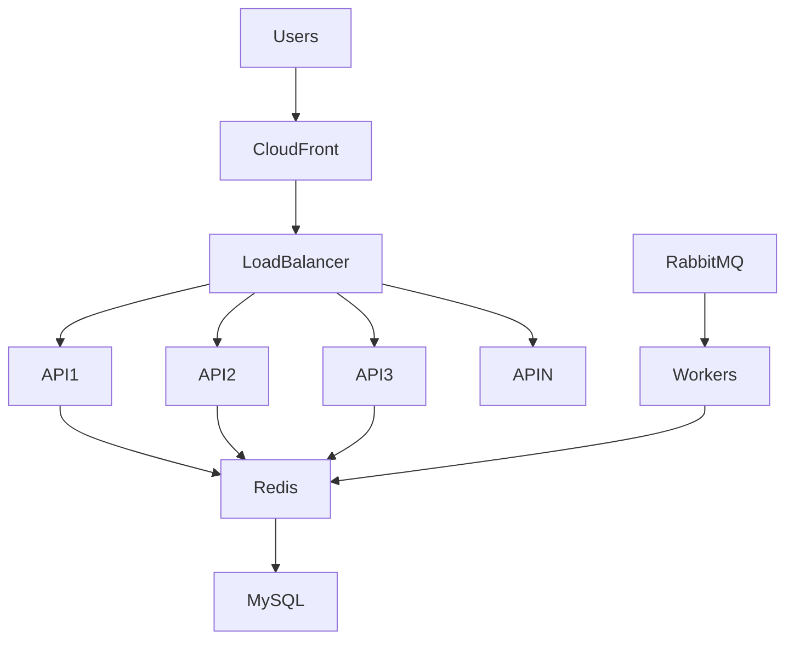
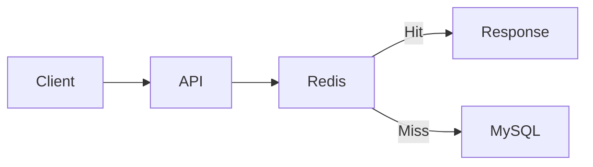
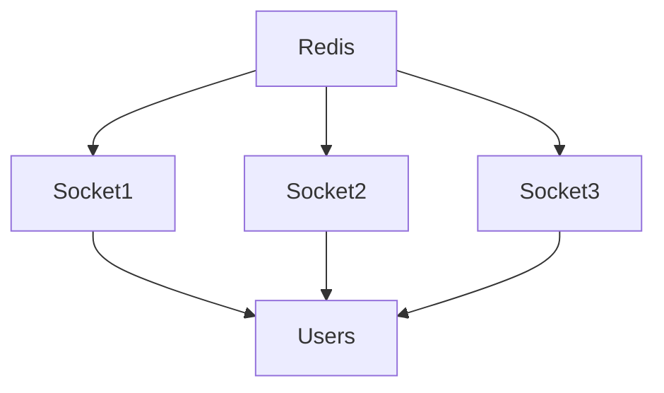
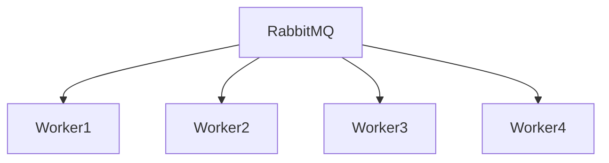

# Engineering Challenge: Handling Traffic Spikes

## Overview

One of the most significant operational challenges faced by Sportswiz was handling sudden and unpredictable traffic spikes during major cricket events.

Unlike traditional business applications that experience relatively stable traffic patterns, sports platforms experience extreme traffic bursts within seconds.

Examples include:

* IPL Matches
* IPL Playoffs
* IPL Finals
* ICC World Cup Matches
* Last Over Finishes
* Super Overs
* Major Wicket Events

During these moments, thousands of users simultaneously request score updates, scorecards, player statistics, and commentary data.

This document describes the architecture and engineering decisions used to ensure platform stability during high-traffic scenarios.

---

# Problem Statement

Traffic patterns were highly unpredictable.

A match could suddenly experience:

```text
10x Traffic Increase
Within Minutes
```

Challenges included:

* API overload
* Database saturation
* Cache pressure
* Socket server congestion
* Queue backlogs

Without proper architecture, service degradation becomes inevitable.

---

# Traffic Characteristics

Sports traffic differs from traditional applications.

---

## Normal Traffic

Example:

```text
2,000 Concurrent Users
```

---

## Peak Traffic

Example:

```text
20,000+ Concurrent Users
```

during major match events.

---

## Burst Traffic

Traffic increases rapidly during:

```text
Wicket
Century
Hat-Trick
Match Winning Shot
```

Users immediately refresh scores and statistics.

---

# High-Level Scaling Architecture



---

# Challenge #1

## API Overload

### Problem

During major matches:

```text
Thousands of Requests Per Second
```

can hit the API layer.

Symptoms:

* Increased latency
* Timeouts
* Failed requests

---

## Solution

Horizontal API Scaling

Architecture:

```text
Load Balancer
      ↓
Multiple API Instances
```

Benefits:

* Increased capacity
* Better availability
* Fault isolation

---

# Autoscaling Strategy

Additional application instances are automatically provisioned.

Triggers:

### CPU Usage

```text
> 70%
```

---

### Memory Usage

```text
> 75%
```

---

### Request Volume

```text
Requests Per Second Threshold
```

Benefits:

* Dynamic scaling
* Reduced operational intervention

---

# Challenge #2

## Database Saturation

### Problem

Every score request hitting MySQL creates excessive load.

Example:

```text
20,000 Users
```

requesting:

```text
Live Score
Every Few Seconds
```

This quickly becomes unsustainable.

---

## Solution

Redis Cache Layer

Architecture:



Benefits:

* Reduced database traffic
* Faster responses
* Improved scalability

---

# Cache-First Strategy

Most live score requests are served directly from Redis.

Examples:

```text
match:101:score
match:101:summary
match:101:commentary
```

Result:

```text
95%+ Reads Served From Cache
```

---

# Challenge #3

## Hot Keys

### Problem

Popular matches create hot Redis keys.

Example:

```text
match:101:score
```

receiving massive request volume.

Potential risks:

* Increased latency
* Resource pressure

---

## Solution

Several mitigation techniques were implemented.

### Optimized Payloads

Only required fields returned.

---

### Efficient TTLs

Short cache lifetimes.

---

### Event-Based Updates

Refresh only when match events occur.

Benefits:

* Reduced Redis load
* Improved throughput

---

# Challenge #4

## Realtime Socket Traffic

### Problem

Thousands of users simultaneously connected.

Potential issues:

```text
Connection Saturation
Broadcast Storms
Resource Exhaustion
```

---

## Solution

Socket.IO Rooms

Example:

```text
match_101
match_102
match_103
```

Users only receive updates for matches they follow.

Benefits:

* Lower bandwidth
* Reduced server load

---

# Redis Adapter

Multiple Socket.IO servers remain synchronized.

Architecture:



Benefits:

* Consistent score delivery
* Horizontal scaling

---

# Challenge #5

## Expensive Statistics Queries

### Problem

Calculating rankings during live matches is expensive.

Examples:

```text
Top Run Scorers
Top Wicket Takers
Tournament Rankings
```

---

## Solution

Precomputed Aggregates

Statistics processed asynchronously.

Flow:

```text
Score Event
      ↓
RabbitMQ
      ↓
Worker
      ↓
Statistics Table
```

Benefits:

* Faster reads
* Lower database load

---

# Challenge #6

## Queue Backlogs

### Problem

High event volume can create RabbitMQ queue growth.

Examples:

```text
Score Events
Notification Events
Analytics Events
```

Potential impacts:

* Delayed processing
* Increased latency

---

## Solution

Worker Scaling

Architecture:



Benefits:

* Parallel processing
* Increased throughput

---

# Load Testing Strategy

Traffic simulations were performed before major tournaments.

---

## Objectives

Validate:

* API performance
* Cache performance
* Queue throughput
* Socket scalability

---

## Example Scenarios

### Scenario 1

```text
5,000 Concurrent Users
```

---

### Scenario 2

```text
10,000 Concurrent Users
```

---

### Scenario 3

```text
20,000 Concurrent Users
```

---

### Scenario 4

```text
Multiple Live Matches
```

running simultaneously.

---

# Performance Metrics

Several metrics were monitored.

---

## API Metrics

```text
Requests Per Second
Response Time
Error Rate
```

---

## Redis Metrics

```text
Hit Ratio
Memory Usage
Latency
```

---

## Database Metrics

```text
Connections
Query Time
Replication Lag
```

---

## RabbitMQ Metrics

```text
Queue Length
Consumer Throughput
```

---

## Socket Metrics

```text
Active Connections
Events Per Second
```

---

# Traffic Protection Mechanisms

Several safeguards were implemented.

---

## Rate Limiting

Protects APIs from abuse.

Example:

```text
100 Requests / Minute
```

per client.

---

## CDN Caching

Static assets served through CloudFront.

Benefits:

* Reduced origin traffic
* Improved frontend performance

---

## Request Throttling

Prevents overload conditions.

---

## Circuit Breakers

Protect downstream services.

Benefits:

* Graceful degradation
* Increased resilience

---

# Failure Scenarios

## API Instance Failure

Traffic redirected automatically.

---

## Redis Slowdown

Database fallback available.

---

## Worker Failure

Messages retained in RabbitMQ.

---

## Socket Server Failure

Clients reconnect to healthy instances.

---

# Operational Lessons

Several key lessons emerged.

### Most Traffic Is Read Traffic

Caching becomes the most important scaling tool.

---

### Realtime Systems Amplify Load

Every score update impacts thousands of users.

---

### Horizontal Scaling Is Essential

Vertical scaling alone is insufficient.

---

### Monitoring Must Be Proactive

Traffic spikes occur rapidly.

---

### Load Testing Prevents Surprises

Realistic simulations expose bottlenecks early.

---

# Engineering Outcome

The traffic spike handling strategy enabled Sportswiz to:

* Remain stable during major tournaments
* Support large concurrent audiences
* Deliver realtime updates reliably
* Protect critical infrastructure components
* Scale efficiently under unpredictable workloads

By combining Redis caching, horizontal scaling, RabbitMQ processing, Socket.IO optimization, and proactive monitoring, the platform maintained consistent performance even during the most demanding cricket events.
