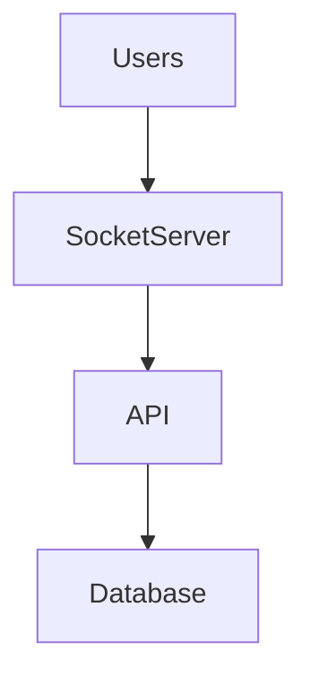
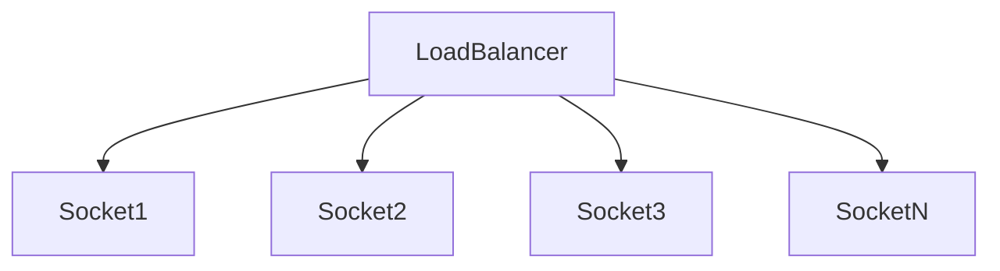
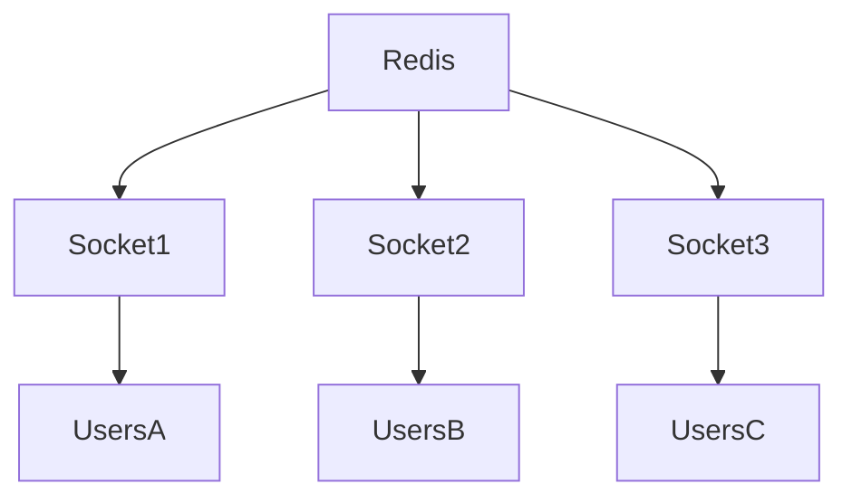
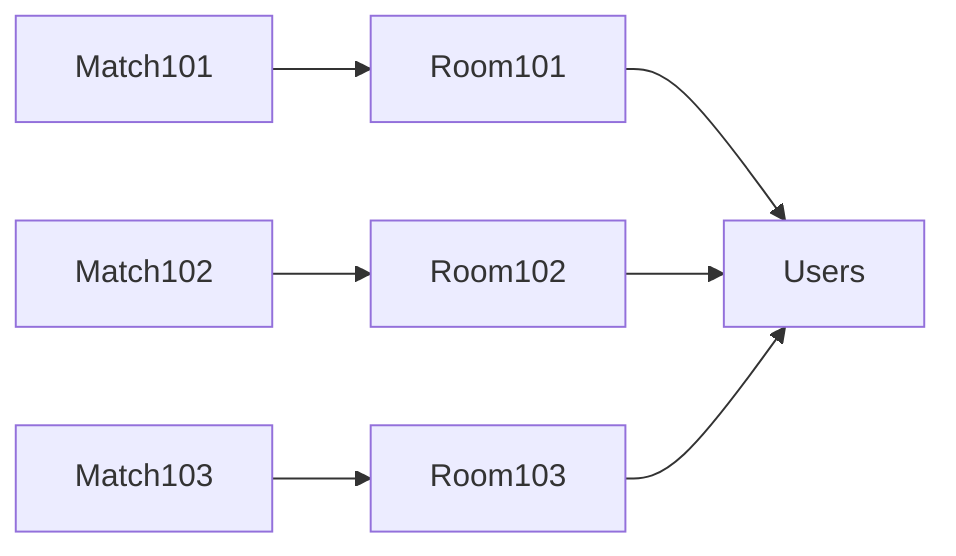
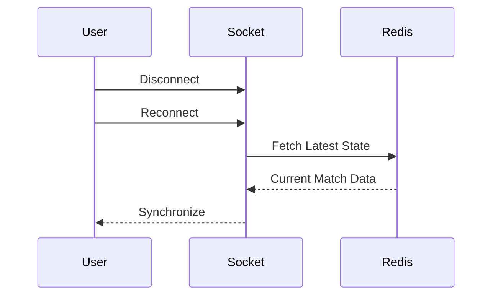
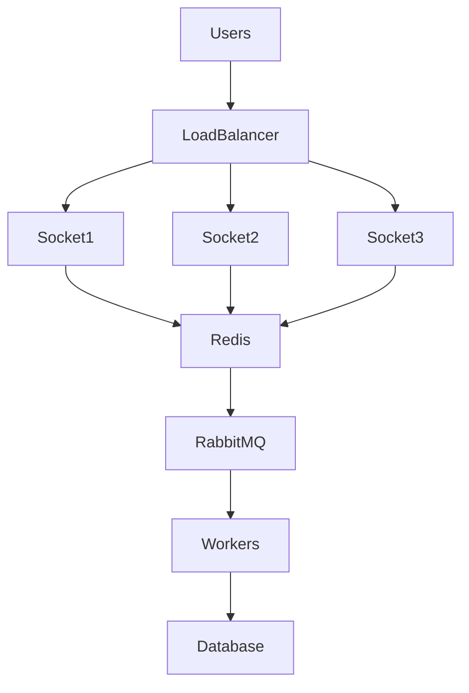

# Engineering Challenge: WebSocket Scaling

## Overview

One of the most critical technical challenges within Sportswiz was scaling realtime communication infrastructure to support thousands of simultaneous users receiving live cricket updates.

Unlike traditional HTTP APIs, WebSocket connections remain open for long periods and consume server resources continuously.

During major cricket tournaments, a single match can attract thousands of connected users who expect:

* Instant score updates
* Live commentary
* Match status changes
* Statistics updates
* Zero manual refresh

Delivering this experience reliably requires careful architectural planning.

---

# Problem Statement

The platform needed to support:

```text
Thousands Of Concurrent Connections

Realtime Score Updates

Low Latency Communication

Multiple Active Matches

Horizontal Scaling
```

while maintaining system reliability and performance.

---

# Why WebSocket Scaling Is Difficult

Traditional HTTP requests are stateless.

Example:

```text
Request
 ↓
Response
 ↓
Connection Closed
```

WebSockets behave differently.

Example:

```text
Connection Open
 ↓
Hours Of Activity
 ↓
Continuous Updates
```

Challenges include:

* Memory consumption
* Connection tracking
* Event broadcasting
* Cross-server synchronization
* Reconnection handling

---

# Initial Architecture

The first implementation used a single Socket.IO server.

Architecture:



Benefits:

* Simple implementation
* Easy debugging

Limitations:

* Single point of failure
* Limited scalability

---

# Challenge #1

## Single Server Bottleneck

### Problem

As user count increased:

```text
1,000 Users
 ↓
5,000 Users
 ↓
10,000 Users
```

the socket server became overloaded.

Symptoms:

* Increased latency
* Higher memory usage
* Event delivery delays

---

## Solution

Horizontal Socket Scaling

Architecture:



Benefits:

* Increased capacity
* Improved reliability
* Better fault tolerance

---

# Challenge #2

## Cross-Server Event Synchronization

### Problem

After introducing multiple socket servers:

Example:

```text
User A → Socket Server 1

User B → Socket Server 2
```

A score update reaching only Server 1 causes:

```text
User A Updated

User B Stale
```

This creates inconsistent match views.

---

## Solution

Redis Adapter

Architecture:



Process:

1. Score update occurs.
2. Redis publishes event.
3. All socket servers receive update.
4. Connected users remain synchronized.

Benefits:

* Consistent state
* Reliable event delivery
* Horizontal scalability

---

# Challenge #3

## Broadcasting Efficiency

### Problem

Without optimization:

```text
Every Event
 ↓
Every User
```

Results:

* Wasted bandwidth
* Increased CPU usage
* Poor scalability

---

## Solution

Match-Based Rooms

Each match receives a dedicated room.

Examples:

```text
match_101

match_102

match_103
```

Users join only the matches they follow.

Benefits:

* Targeted broadcasts
* Reduced bandwidth
* Improved efficiency

---

# Room Architecture



---

# Challenge #4

## High Frequency Updates

### Problem

A cricket match generates many events.

Examples:

```text
Runs

Wickets

Extras

Commentary

Statistics
```

Each event potentially triggers broadcasts.

---

## Solution

Event Categorization

Examples:

### Critical Events

Broadcast immediately.

```text
score.updated

wicket.fallen
```

---

### Non-Critical Events

Can be aggregated.

```text
statistics.updated

analytics.updated
```

Benefits:

* Lower network overhead
* Better scalability

---

# Challenge #5

## Sticky Sessions

### Problem

WebSockets require connection persistence.

Without sticky sessions:

```text
Request 1 → Server A

Request 2 → Server B
```

Connection state becomes inconsistent.

---

## Solution

Load Balancer Session Affinity

Benefits:

* Stable connections
* Reduced reconnects
* Better user experience

---

# Challenge #6

## Connection Lifecycle Management

### Problem

Users frequently:

```text
Disconnect

Reconnect

Switch Networks

Background Applications
```

Without proper handling:

* Missed events
* Stale scores
* User frustration

---

## Solution

Automatic Reconnection

Process:



Benefits:

* Better resilience
* Improved experience

---

# Challenge #7

## Memory Consumption

### Problem

Each WebSocket connection consumes memory.

Example:

```text
20,000 Active Users
```

can significantly increase resource usage.

---

## Solution

Efficient Connection Management

Strategies:

### Lightweight Sessions

Store minimal connection metadata.

---

### Room-Based Tracking

Track only required subscriptions.

---

### Cleanup Mechanisms

Remove stale connections automatically.

Benefits:

* Reduced memory pressure
* Improved stability

---

# Challenge #8

## Event Storms

### Problem

Major match moments generate large bursts of activity.

Examples:

```text
Hat Trick

Century

Last Over Finish

Super Over
```

Thousands of users receive updates simultaneously.

---

## Solution

Horizontal Scaling + Redis Pub/Sub

Architecture:

```text
Event
 ↓
Redis
 ↓
Multiple Socket Servers
 ↓
Users
```

Benefits:

* Distributed workload
* Better throughput

---

# Challenge #9

## Monitoring Realtime Infrastructure

### Problem

WebSocket failures are harder to detect than API failures.

Users remain connected but may not receive events.

---

## Solution

Dedicated Realtime Metrics

Monitored Metrics:

### Connections

```text
Active Connections

Connections Per Match
```

---

### Events

```text
Events Per Second

Broadcast Rate
```

---

### Latency

```text
Message Delivery Time
```

---

### Errors

```text
Failed Broadcasts

Reconnect Failures
```

Benefits:

* Faster detection
* Better observability

---

# Scaling Architecture

Final production architecture:



---

# Performance Optimizations

Several optimizations were implemented.

---

## Match Rooms

Reduced unnecessary broadcasts.

---

## Small Payloads

Example:

Instead of:

```json
{
  "fullScorecard": {}
}
```

Use:

```json
{
  "score": "145/4",
  "over": "17.2"
}
```

Benefits:

* Lower bandwidth
* Faster delivery

---

## Redis Synchronization

Ensures consistent state.

---

## Horizontal Scaling

Additional servers added during tournaments.

Benefits:

* Elastic capacity
* Improved resilience

---

# Failure Scenarios

## Socket Server Failure

Recovery:

```text
Client Reconnect
 ↓
Load Balancer
 ↓
Healthy Server
```

---

## Redis Failure

Fallback:

```text
Fetch Latest State
From Database
```

---

## Network Interruptions

Automatic reconnection logic restores state.

---

# Lessons Learned

Several important lessons emerged.

---

## Realtime Systems Scale Differently

Connection management becomes as important as request handling.

---

## Rooms Are Essential

Broadcasting to everyone is unsustainable.

---

## Redis Adapter Is Critical

Cross-server synchronization becomes mandatory once scaling begins.

---

## Monitoring Matters

Realtime failures often occur silently.

---

## Small Payloads Win

Every byte matters at scale.

---

# Engineering Outcome

The WebSocket scaling architecture enabled Sportswiz to:

* Support large concurrent audiences
* Deliver low-latency score updates
* Maintain consistent match state
* Scale horizontally during tournaments
* Improve system reliability

By combining Socket.IO, Redis Pub/Sub, match rooms, load balancing, and robust monitoring, the platform successfully delivered realtime cricket experiences at production scale while maintaining performance and operational stability.
