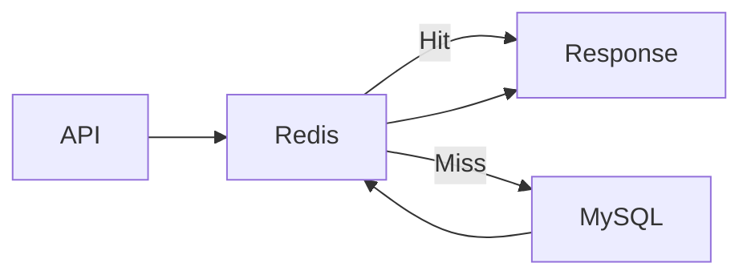

# Query Optimization Strategy

## Overview

Database performance is a critical factor in the overall responsiveness of Sportswiz.

While indexing improves lookup efficiency, query optimization ensures that database resources are utilized effectively under high traffic conditions.

As the platform processes live matches, ball-by-ball events, player statistics, tournament data, and administrative operations, poorly optimized queries can quickly become bottlenecks.

The query optimization strategy focuses on:

* Reducing execution time
* Minimizing database load
* Improving scalability
* Supporting realtime workloads
* Lowering infrastructure costs

---

# Optimization Objectives

The primary goals include:

### Faster Response Times

Reduce API latency for users.

### Lower Resource Utilization

Reduce CPU, memory, and disk I/O.

### Better Scalability

Support increasing traffic without database degradation.

### Predictable Performance

Maintain stable query execution times under load.

---

# Query Design Principles

Several principles guide query development.

---

## Retrieve Only Required Data

Bad Example:

```sql
SELECT *
FROM players;
```

Problem:

* Unnecessary columns returned
* Increased network overhead

---

Good Example:

```sql
SELECT id, name, role
FROM players;
```

Benefits:

* Smaller result sets
* Faster responses

---

# Avoid N+1 Query Problems

One of the most common performance issues.

---

## Bad Example

Load players:

```sql
SELECT *
FROM players;
```

Then:

```sql
SELECT *
FROM player_stats
WHERE player_id = ?;
```

for every player.

Problem:

```text
1 Query + N Queries
```

---

## Optimized Solution

```sql
SELECT
    p.id,
    p.name,
    ps.runs,
    ps.wickets
FROM players p
JOIN player_stats ps
ON p.id = ps.player_id;
```

Benefits:

* Single database request
* Reduced latency

---

# Efficient Joins

Joins are heavily used throughout the platform.

Examples:

* Match scorecards
* Player profiles
* Tournament standings

---

## Join Best Practices

### Join Indexed Columns

Example:

```sql
JOIN players p
ON p.id = ps.player_id
```

Benefits:

* Faster execution
* Better query plans

---

### Avoid Unnecessary Joins

Only join required tables.

---

# Pagination Strategy

Large datasets should never be loaded entirely.

---

## Bad Example

```sql
SELECT *
FROM matches;
```

Problem:

* Large memory usage
* Slow responses

---

## Pagination

```sql
SELECT *
FROM matches
LIMIT 20 OFFSET 0;
```

Benefits:

* Faster responses
* Better user experience

---

# Cursor-Based Pagination

Preferred for high-volume datasets.

Example:

```sql
SELECT *
FROM balls
WHERE id > 1000
LIMIT 100;
```

Benefits:

* Better performance
* Consistent pagination

---

# Aggregation Optimization

Sportswiz performs extensive statistical calculations.

Examples:

* Player rankings
* Tournament standings
* Match summaries

---

## Heavy Aggregation Example

```sql
SELECT
    player_id,
    SUM(runs)
FROM balls
GROUP BY player_id;
```

Problem:

Expensive on large datasets.

---

## Optimized Approach

Use precomputed statistics.

Table:

```text
player_stats
```

Benefits:

* Faster reads
* Lower CPU usage

---

# Materialized Aggregates

Frequently accessed metrics are stored separately.

Examples:

```text
Total Runs
Career Wickets
Batting Average
Economy Rate
```

Benefits:

* Reduced calculations
* Faster APIs

---

# Realtime Query Optimization

Live matches require special handling.

---

## Avoid Recalculating Scorecards

Bad Approach:

Generate scorecard from ball events every request.

---

Good Approach:

Maintain precomputed scorecard tables.

Examples:

```text
scorecards
match_summary
```

Benefits:

* Low latency
* Better scalability

---

# Query Caching

Frequently executed queries are cached using Redis.

Examples:

```text
Live Matches
Player Profiles
Tournament Standings
```

Benefits:

* Reduced database traffic
* Faster responses

---

# Cache Integration Flow



---

# Selective Denormalization

Not all data remains fully normalized.

Examples:

### Match Summary

Contains:

```text
Runs
Wickets
Overs
Run Rate
```

Stored together.

Benefits:

* Faster reads
* Reduced joins

---

# Query Batching

Multiple requests can be combined.

Example:

Instead of:

```text
10 separate player requests
```

Use:

```sql
SELECT *
FROM players
WHERE id IN (1,2,3,4,5,6,7,8,9,10);
```

Benefits:

* Fewer round trips
* Better throughput

---

# Avoiding Expensive Operations

The following operations are minimized.

---

## Large OFFSET Values

Bad Example:

```sql
LIMIT 20 OFFSET 500000;
```

Problem:

MySQL still scans skipped rows.

---

## Unindexed Sorting

Bad Example:

```sql
ORDER BY runs DESC;
```

without index.

Problem:

Expensive sorting.

---

## Leading Wildcards

Bad Example:

```sql
WHERE name LIKE '%kohli'
```

Problem:

Cannot use index efficiently.

---

# EXPLAIN Analysis

All critical queries are analyzed.

Example:

```sql
EXPLAIN
SELECT *
FROM matches
WHERE status = 'LIVE';
```

Metrics evaluated:

### Rows Examined

Lower is better.

---

### Key Used

Ensure correct index selection.

---

### Access Type

Preferred:

```text
const
ref
range
```

Avoid:

```text
ALL
```

---

# Slow Query Investigation

Slow queries are continuously monitored.

Process:

### Step 1

Identify query.

### Step 2

Analyze execution plan.

### Step 3

Check indexes.

### Step 4

Optimize joins.

### Step 5

Validate improvements.

---

# Read Replica Optimization

Read-heavy workloads are distributed.

Examples:

```text
Rankings
Reports
Analytics
Statistics
```

Benefits:

* Reduced primary load
* Better scalability

---

# Realtime Scoring Optimization

Ball-by-ball scoring requires special considerations.

---

## Write Path

Optimized for:

* Fast inserts
* Minimal locking
* Efficient transactions

---

## Read Path

Optimized through:

* Redis caching
* Aggregated tables
* Indexed lookups

---

# Transaction Optimization

Transactions remain small.

Bad Example:

```text
Update Score
Update Rankings
Update Notifications
Update Analytics
```

in one transaction.

---

Good Example:

```text
Update Score
Commit

Publish Events
```

Benefits:

* Reduced lock contention
* Better throughput

---

# Database Monitoring

Several metrics are monitored continuously.

---

## Query Metrics

* Execution Time
* Rows Examined
* Queries Per Second

---

## Resource Metrics

* CPU Usage
* Memory Usage
* Disk I/O

---

## Connection Metrics

* Active Connections
* Connection Pool Usage

---

# Production Tuning

MySQL configuration is optimized for:

### Connection Pooling

Efficient connection reuse.

---

### Buffer Pools

Reduce disk reads.

---

### Query Cache Alternatives

Handled through Redis.

---

### Read Replicas

Improve read scalability.

---

# Future Improvements

Potential enhancements include:

### CQRS

Separate read and write models.

---

### Event Sourcing

Immutable event streams.

---

### Data Warehouse

Dedicated analytics platform.

---

### Search Infrastructure

Elasticsearch integration.

---

# Engineering Outcome

The query optimization strategy enables Sportswiz to:

* Deliver low-latency APIs
* Support realtime cricket operations
* Reduce database bottlenecks
* Scale efficiently under traffic spikes
* Maintain predictable performance

Combined with indexing, caching, and asynchronous processing, query optimization plays a major role in ensuring a responsive and reliable platform experience.
