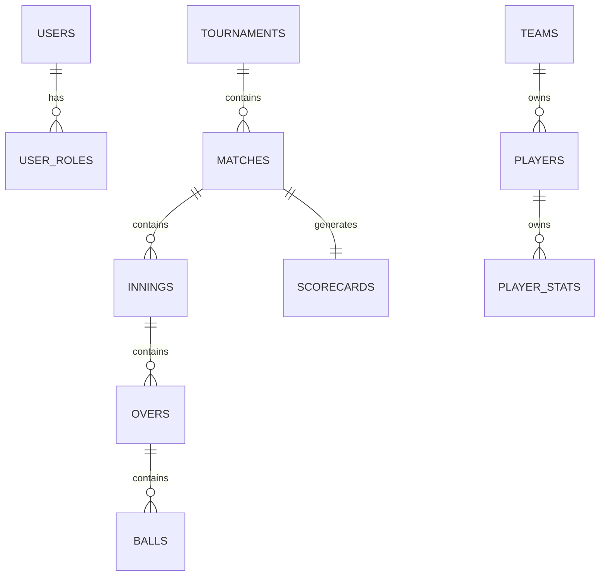

# Database Schema Design

## Overview

The Sportswiz database is designed to support a large-scale cricket ecosystem capable of managing tournaments, teams, players, matches, realtime scoring, statistics, and analytics.

MySQL serves as the primary source of truth for all platform data.

The schema follows a normalized relational design while selectively denormalizing high-read datasets for performance optimization.

---

# Design Goals

The database was designed to achieve:

* Data integrity
* Scalability
* Query performance
* Maintainability
* Analytics readiness

---

# Core Domain Areas

The schema is organized into several logical domains:

### User Management

* Users
* Roles
* Permissions

### Cricket Operations

* Teams
* Players
* Tournaments
* Matches

### Realtime Scoring

* Innings
* Overs
* Balls
* Scorecards

### Statistics

* Player Stats
* Team Stats
* Rankings

### System Operations

* Notifications
* Audit Logs
* Activity Tracking

---

# High-Level Entity Relationship



---

# User Management

## Users

Stores platform users.

### Table

```sql
users
```

### Fields

| Column     | Type     |
| ---------- | -------- |
| id         | BIGINT   |
| name       | VARCHAR  |
| email      | VARCHAR  |
| password   | VARCHAR  |
| status     | ENUM     |
| created_at | DATETIME |

---

## Roles

Stores authorization roles.

### Examples

```text
Super Admin
Tournament Admin
Scorer
Team Manager
User
```

---

## User Roles

Maps users to roles.

### Relationship

```text
User → Many Roles
Role → Many Users
```

---

# Team Management

## Teams

Stores cricket teams.

### Fields

| Column | Type    |
| ------ | ------- |
| id     | BIGINT  |
| name   | VARCHAR |
| logo   | VARCHAR |
| city   | VARCHAR |
| status | ENUM    |

---

## Players

Stores player profiles.

### Fields

| Column        | Type    |
| ------------- | ------- |
| id            | BIGINT  |
| team_id       | BIGINT  |
| name          | VARCHAR |
| role          | ENUM    |
| batting_style | VARCHAR |
| bowling_style | VARCHAR |

---

## Player Roles

Supported roles:

```text
Batsman
Bowler
All Rounder
Wicket Keeper
```

---

# Tournament Management

## Tournaments

Stores tournament information.

### Fields

| Column     | Type    |
| ---------- | ------- |
| id         | BIGINT  |
| name       | VARCHAR |
| season     | VARCHAR |
| start_date | DATE    |
| end_date   | DATE    |
| status     | ENUM    |

---

## Tournament Teams

Associates teams with tournaments.

### Relationship

```text
Tournament
      ↓
Tournament Teams
      ↓
Team
```

---

# Match Management

## Matches

Represents individual matches.

### Fields

| Column        | Type     |
| ------------- | -------- |
| id            | BIGINT   |
| tournament_id | BIGINT   |
| team_a_id     | BIGINT   |
| team_b_id     | BIGINT   |
| venue_id      | BIGINT   |
| status        | ENUM     |
| start_time    | DATETIME |

---

## Match Status

Supported values:

```text
Scheduled
Live
Completed
Abandoned
Cancelled
```

---

## Venues

Stores match venue information.

### Fields

| Column  | Type    |
| ------- | ------- |
| id      | BIGINT  |
| name    | VARCHAR |
| city    | VARCHAR |
| country | VARCHAR |

---

# Scoring Engine Tables

These tables form the heart of the realtime scoring system.

---

## Innings

Stores innings information.

### Fields

| Column          | Type   |
| --------------- | ------ |
| id              | BIGINT |
| match_id        | BIGINT |
| batting_team_id | BIGINT |
| bowling_team_id | BIGINT |
| inning_number   | INT    |

---

## Overs

Stores over-level data.

### Fields

| Column      | Type   |
| ----------- | ------ |
| id          | BIGINT |
| innings_id  | BIGINT |
| over_number | INT    |

---

## Balls

Stores ball-by-ball events.

### Fields

| Column      | Type     |
| ----------- | -------- |
| id          | BIGINT   |
| innings_id  | BIGINT   |
| over_id     | BIGINT   |
| batsman_id  | BIGINT   |
| bowler_id   | BIGINT   |
| runs        | INT      |
| extra_type  | VARCHAR  |
| wicket_type | VARCHAR  |
| created_at  | DATETIME |

---

# Why Ball-Level Storage

Storing every delivery enables:

* Detailed scorecards
* Match replay
* Commentary generation
* Statistics calculation
* Historical analysis

---

# Scorecards

Stores aggregated match data.

### Fields

| Column   | Type    |
| -------- | ------- |
| id       | BIGINT  |
| match_id | BIGINT  |
| team_id  | BIGINT  |
| runs     | INT     |
| wickets  | INT     |
| overs    | DECIMAL |

---

# Statistics Module

## Player Statistics

Stores player performance metrics.

### Fields

| Column    | Type   |
| --------- | ------ |
| id        | BIGINT |
| player_id | BIGINT |
| matches   | INT    |
| runs      | INT    |
| wickets   | INT    |
| catches   | INT    |

---

# Batting Statistics

Examples:

```text
Runs
Balls Faced
Fours
Sixes
Strike Rate
Average
```

---

# Bowling Statistics

Examples:

```text
Overs
Wickets
Economy
Dot Balls
Maidens
```

---

# Team Statistics

Stores aggregate team metrics.

Examples:

```text
Matches Played
Wins
Losses
Points
Net Run Rate
```

---

# Rankings

Stores leaderboard information.

Examples:

```text
Top Batsmen
Top Bowlers
Top Teams
```

---

# Notifications

## Notifications Table

Stores user notifications.

### Fields

| Column  | Type    |
| ------- | ------- |
| id      | BIGINT  |
| user_id | BIGINT  |
| title   | VARCHAR |
| message | TEXT    |
| status  | ENUM    |

---

# Audit Logs

Tracks critical system actions.

Examples:

```text
Match Updates
Tournament Changes
Role Modifications
User Actions
```

Benefits:

* Security
* Compliance
* Debugging

---

# Relationship Summary

```text
Tournament
   ↓
Matches
   ↓
Innings
   ↓
Overs
   ↓
Balls
```

```text
Team
   ↓
Players
   ↓
Player Stats
```

---

# Data Retention Strategy

Different datasets have different retention requirements.

### Match Data

Retained indefinitely.

### Ball Events

Retained indefinitely for historical analytics.

### Audit Logs

Archived periodically.

### Notifications

Archived after defined retention period.

---

# Performance Considerations

The schema was designed with performance in mind.

### Optimizations

* Proper indexing
* Foreign key constraints
* Query optimization
* Selective denormalization
* Cache integration

---

# Scalability Considerations

As platform usage grows:

### Read Scaling

Supported through:

* Redis
* Read replicas

### Write Scaling

Supported through:

* Optimized transactions
* Queue processing

### Analytics Scaling

Supported through:

* Background workers
* Materialized aggregates

---

# Future Enhancements

Potential improvements include:

### Event Sourcing

Store all match events as immutable records.

### CQRS

Separate read and write models.

### Data Warehouse

Dedicated analytics infrastructure.

### Time-Series Storage

Advanced historical statistics analysis.

---

# Engineering Outcome

The database schema provides a strong foundation for:

* Live scoring
* Tournament operations
* Statistics generation
* Analytics reporting
* Realtime updates
* Long-term scalability

The design balances normalization, performance, and maintainability while supporting the operational requirements of a production-grade cricket ecosystem.
