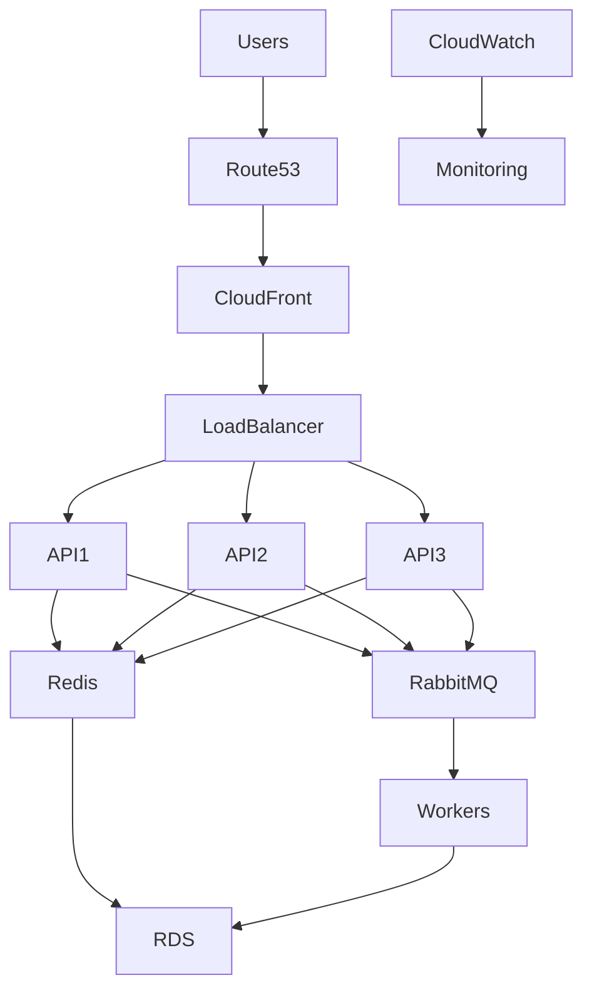
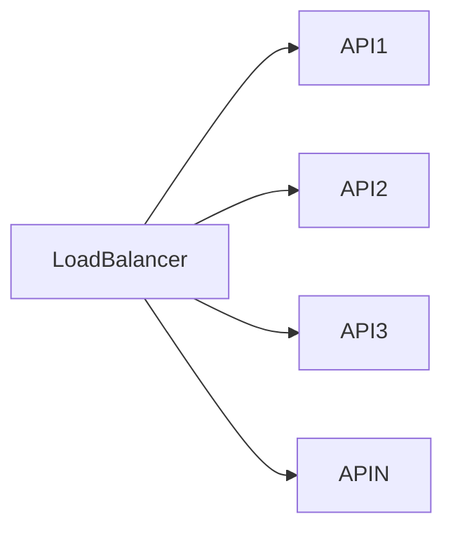
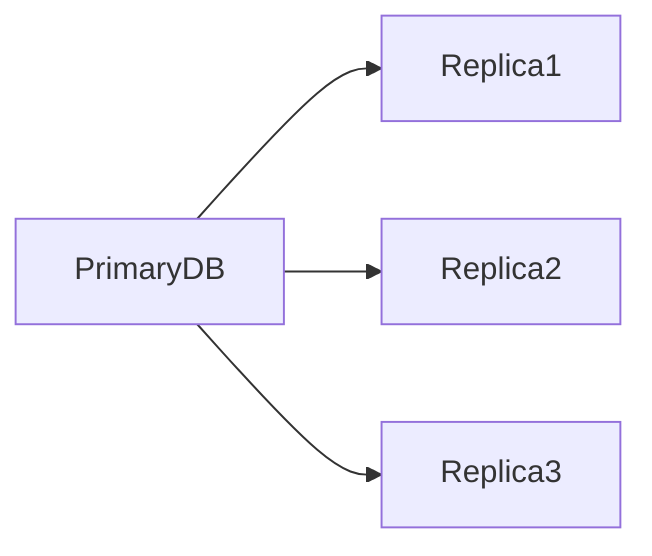
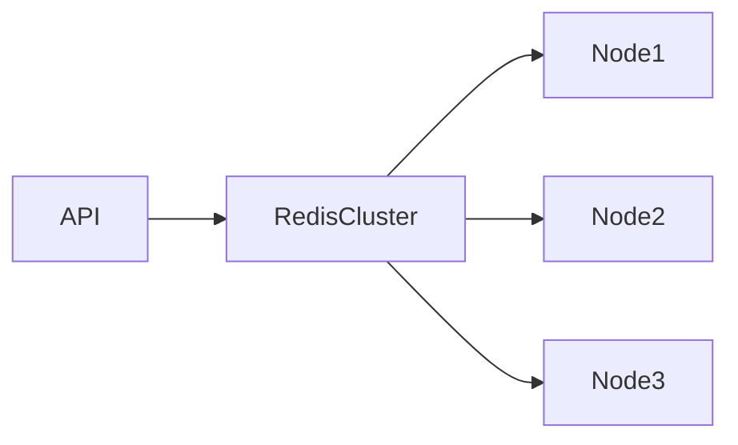
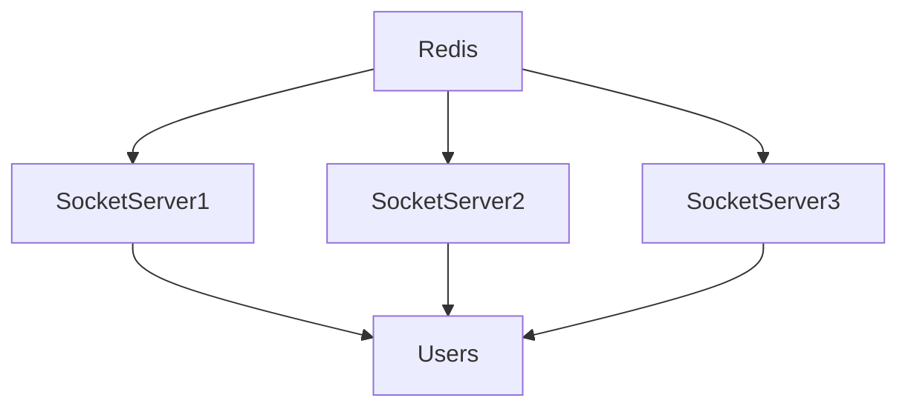

# AWS Infrastructure Architecture

## Overview

Sportswiz is designed as a cloud-native platform capable of supporting realtime cricket scoring, tournament operations, analytics workloads, and large-scale user traffic.

AWS was selected as the infrastructure platform due to its scalability, reliability, managed services ecosystem, and operational maturity.

The infrastructure architecture focuses on:

* High Availability
* Scalability
* Reliability
* Security
* Cost Optimization
* Operational Simplicity

---

# Infrastructure Goals

The infrastructure was designed to support:

### Realtime Traffic

Thousands of concurrent users consuming live match updates.

### High Availability

Minimize downtime during critical tournaments.

### Horizontal Scaling

Increase capacity dynamically during traffic spikes.

### Fault Tolerance

Recover gracefully from infrastructure failures.

### Operational Visibility

Provide comprehensive monitoring and alerting.

---

# High-Level AWS Architecture



---

# Infrastructure Components

## Route 53

Acts as the DNS management layer.

Responsibilities:

* Domain resolution
* Health checks
* Traffic routing

Benefits:

* Highly available DNS
* Fast global resolution

---

# CloudFront CDN

CloudFront serves as the content delivery network.

Used for:

* Images
* Static Assets
* JavaScript Bundles
* CSS Files

Benefits:

* Reduced latency
* Improved frontend performance
* Lower origin server load

---

# Application Load Balancer

The load balancer distributes traffic across backend services.

Responsibilities:

* Request routing
* SSL termination
* Health checks
* Traffic balancing

Benefits:

* High availability
* Automatic failover
* Better performance

---

# Backend Services

NestJS APIs run behind the load balancer.

Responsibilities:

* Authentication
* Match Operations
* Scoring APIs
* Tournament Management
* Analytics

Characteristics:

* Stateless
* Horizontally scalable
* Container-friendly

---

# API Scaling Model



Benefits:

* Fault isolation
* Elastic scaling
* Improved reliability

---

# Database Layer

## Amazon RDS (MySQL)

RDS serves as the primary database platform.

Responsibilities:

* Persistent storage
* Transactions
* Relational data management

Benefits:

* Automated backups
* Automated patching
* Managed failover
* Monitoring integration

---

# Database Architecture



---

## Primary Database

Handles:

* Inserts
* Updates
* Deletes

Examples:

```text
Score Updates
Player Statistics
Tournament Operations
```

---

## Read Replicas

Handle:

```text
Reports
Rankings
Analytics
Historical Data
```

Benefits:

* Reduced load on primary database
* Better read throughput

---

# Redis Infrastructure

Redis acts as the distributed caching layer.

Responsibilities:

* Match Data
* Live Scores
* Scorecards
* Rankings
* Session Data

Benefits:

* Sub-millisecond reads
* Reduced database load
* Realtime synchronization

---

# Redis Architecture



---

# RabbitMQ Infrastructure

RabbitMQ powers asynchronous processing.

Responsibilities:

* Event Distribution
* Statistics Processing
* Cache Refreshes
* Notifications
* Analytics Workloads

Benefits:

* Decoupled architecture
* Better scalability
* Faster APIs

---

# Worker Infrastructure

Dedicated worker nodes consume RabbitMQ messages.

Examples:

```text
Score Worker
Stats Worker
Analytics Worker
Notification Worker
Cache Worker
```

Benefits:

* Independent scaling
* Better throughput

---

# Realtime Infrastructure

Socket.IO powers realtime communication.

Responsibilities:

* Live Scores
* Commentary Updates
* Match Events

Architecture:



Benefits:

* Horizontal scaling
* Consistent event delivery

---

# Storage Layer

## Amazon S3

Stores:

* Team Logos
* Player Images
* Tournament Media
* Static Assets

Benefits:

* Durable storage
* Low operational overhead

---

# Security Architecture

Security is implemented at multiple layers.

---

## Network Security

Protected through:

* Security Groups
* Private Subnets
* VPC Isolation

---

## Application Security

Includes:

* JWT Authentication
* Role-Based Access Control
* Input Validation

---

## Data Security

Includes:

* Encryption at Rest
* Encryption in Transit
* Secure Secrets Management

---

# Deployment Strategy

Infrastructure supports zero-downtime deployments.

Process:

```text
Build
 ↓
Test
 ↓
Deploy
 ↓
Health Check
 ↓
Traffic Shift
```

Benefits:

* Reduced downtime
* Safer releases

---

# Monitoring Infrastructure

Monitoring is essential for production operations.

---

## CloudWatch

Tracks:

* CPU Usage
* Memory Usage
* Network Throughput
* Disk Utilization

---

## Application Monitoring

Tracks:

* API Response Times
* Error Rates
* Request Volumes

---

## Database Monitoring

Tracks:

* Slow Queries
* Replication Lag
* Connection Usage

---

## Redis Monitoring

Tracks:

* Cache Hit Ratio
* Memory Consumption
* Command Latency

---

## RabbitMQ Monitoring

Tracks:

* Queue Depth
* Consumer Throughput
* Retry Counts

---

# Logging Architecture

Centralized logging improves observability.

Logs collected:

```text
API Logs
Application Logs
Worker Logs
Database Logs
Infrastructure Logs
```

Benefits:

* Faster debugging
* Better incident response

---

# Auto Scaling Strategy

Infrastructure scales automatically.

Triggers:

### CPU Utilization

Example:

```text
> 70%
```

---

### Memory Usage

Example:

```text
> 75%
```

---

### Request Volume

Traffic spikes automatically trigger scaling.

---

# Backup Strategy

## Database Backups

Automated daily backups.

Retention:

```text
7-30 Days
```

---

## Redis Snapshots

Periodic persistence for recovery.

---

## S3 Versioning

Protects uploaded assets.

---

# Disaster Recovery

Recovery objectives include:

### RPO

Recovery Point Objective

```text
< 15 Minutes
```

---

### RTO

Recovery Time Objective

```text
< 1 Hour
```

---

# Cost Optimization

Several strategies reduce infrastructure costs.

### CloudFront Caching

Reduces backend requests.

### Redis Caching

Reduces database load.

### Autoscaling

Prevents over-provisioning.

### Read Replicas

Optimize workload distribution.

---

# Future Infrastructure Improvements

Potential enhancements include:

### Kubernetes

Container orchestration.

### Multi-Region Deployment

Global resilience.

### Service Mesh

Advanced traffic management.

### Kafka Integration

High-volume event streaming.

### Distributed Tracing

End-to-end request visibility.

---

# Engineering Outcome

The AWS infrastructure architecture provides:

* High availability
* Elastic scalability
* Operational reliability
* Strong security posture
* Efficient resource utilization

The platform is capable of supporting large-scale cricket operations, realtime match experiences, and future growth while maintaining strong performance and reliability characteristics.
