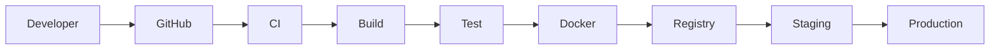
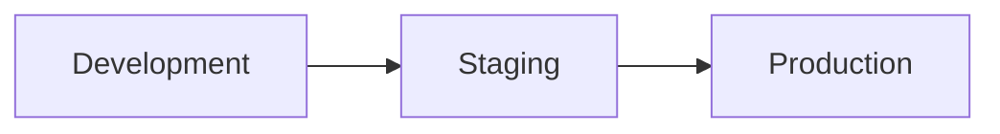
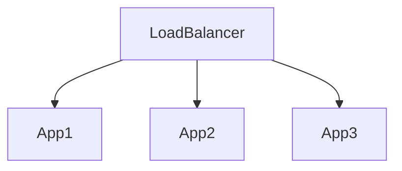
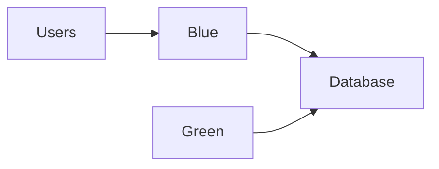

# Deployment Pipeline

## Overview

A reliable deployment pipeline is critical for maintaining application stability, reducing deployment risk, and ensuring rapid delivery of new features.

Sportswiz follows a CI/CD approach that automates building, testing, deployment, and validation processes.

The deployment strategy was designed to achieve:

* Faster releases
* Reduced human error
* Consistent deployments
* Zero-downtime updates
* Quick rollback capability

---

# Deployment Goals

The deployment process focuses on:

### Reliability

Deployments should be predictable and repeatable.

### Speed

Code should move from development to production quickly.

### Safety

Failures should be detected before affecting users.

### Observability

Deployment health should be continuously monitored.

---

# CI/CD Overview



---

# Source Control Workflow

The platform follows a Git-based workflow.

## Branch Structure

```text
main
develop
feature/*
hotfix/*
release/*
```

---

## Main Branch

Represents production-ready code.

Only validated code reaches this branch.

---

## Develop Branch

Integration branch for ongoing development.

---

## Feature Branches

Used for individual features.

Example:

```text
feature/live-score-enhancement
feature/player-rankings
feature/tournament-module
```

---

## Hotfix Branches

Used for urgent production fixes.

Example:

```text
hotfix/socket-reconnection
```

---

# Continuous Integration

Every pull request triggers automated validation.

Pipeline Steps:

```text
Install Dependencies
 ↓
Linting
 ↓
Unit Tests
 ↓
Build Verification
 ↓
Security Checks
```

---

# Code Quality Checks

Automated checks include:

### ESLint

Maintains coding standards.

### Prettier

Ensures formatting consistency.

### Type Checking

Validates TypeScript correctness.

### Build Validation

Ensures successful compilation.

---

# Automated Testing

Testing is performed before deployment.

---

## Unit Tests

Validate individual components.

Examples:

* Services
* Utilities
* Controllers

---

## Integration Tests

Validate interactions between components.

Examples:

* API Endpoints
* Database Operations
* Authentication Flows

---

## Smoke Tests

Verify critical platform functionality.

Examples:

```text
Login
Live Match APIs
Score Updates
Tournament Creation
```

---

# Dockerization

Applications are packaged into Docker containers.

Benefits:

* Consistent environments
* Easier deployments
* Better portability

---

## Container Components

Examples:

```text
Frontend Container
Backend Container
Worker Container
Socket Server Container
```

---

# Container Registry

Built images are stored in a centralized registry.

Benefits:

* Version control
* Deployment consistency
* Rollback support

---

# Environment Strategy

The platform uses multiple environments.

---

## Development

Used by engineers during feature development.

Characteristics:

* Rapid iteration
* Frequent deployments

---

## Staging

Production-like environment.

Used for:

* QA Testing
* Regression Testing
* Release Validation

---

## Production

Serves live users.

Characteristics:

* High availability
* Strict deployment controls

---

# Environment Flow



---

# Deployment Architecture



Benefits:

* High availability
* Rolling deployments
* Reduced downtime

---

# Deployment Process

### Step 1

Developer merges code.

---

### Step 2

CI pipeline executes.

Checks:

```text
Lint
Tests
Build
```

---

### Step 3

Docker image is created.

Example:

```text
sportswiz-api:v1.4.2
```

---

### Step 4

Image is pushed to registry.

---

### Step 5

Deployment begins in staging.

---

### Step 6

Smoke tests execute.

---

### Step 7

Production deployment begins.

---

# Rolling Deployments

Rolling deployments minimize downtime.

Process:

```text
Instance 1 Updated
 ↓
Health Check
 ↓
Instance 2 Updated
 ↓
Health Check
 ↓
Instance 3 Updated
```

Benefits:

* Continuous availability
* Safer deployments

---

# Blue-Green Deployment Strategy

For critical releases.

Architecture:



Deployment Process:

1. Green environment deployed.
2. Validation performed.
3. Traffic switched.
4. Blue retained for rollback.

Benefits:

* Near-zero downtime
* Fast rollback

---

# Health Checks

Every deployment is validated.

Checks include:

### API Availability

```text
GET /health
```

---

### Database Connectivity

Verifies database access.

---

### Redis Connectivity

Verifies cache access.

---

### RabbitMQ Connectivity

Verifies messaging layer.

---

# Rollback Strategy

Failures must be reversible.

---

## Trigger Conditions

Examples:

```text
High Error Rate
Failed Health Checks
Performance Degradation
```

---

## Rollback Process

```text
Stop New Deployment
 ↓
Restore Previous Version
 ↓
Verify Health
 ↓
Resume Traffic
```

Benefits:

* Reduced downtime
* Faster recovery

---

# Secrets Management

Sensitive credentials are never stored in source code.

Examples:

```text
Database Credentials
JWT Secrets
Redis Credentials
RabbitMQ Credentials
AWS Keys
```

Managed through:

* Environment Variables
* Secret Stores
* IAM Policies

---

# Infrastructure Validation

Before deployment:

### Configuration Checks

Validate environment configuration.

### Dependency Validation

Verify required services.

### Security Validation

Check permissions and secrets.

---

# Monitoring During Deployment

Deployments are continuously monitored.

Metrics include:

### Error Rate

Tracks deployment stability.

---

### Response Time

Detects performance regressions.

---

### Throughput

Measures request handling capacity.

---

### Resource Utilization

Tracks:

* CPU
* Memory
* Network

---

# Deployment Metrics

Key metrics tracked:

### Deployment Frequency

How often releases occur.

### Lead Time

Time from commit to production.

### Change Failure Rate

Percentage of failed releases.

### Recovery Time

Time to restore service.

---

# Incident Response

If issues occur:

### Detection

Monitoring alerts trigger.

### Investigation

Logs and metrics analyzed.

### Mitigation

Rollback or hotfix applied.

### Postmortem

Lessons documented.

---

# Security in CI/CD

Security checks are integrated into the pipeline.

Examples:

### Dependency Scanning

Identify vulnerable packages.

### Secret Detection

Prevent credential leaks.

### Static Analysis

Identify potential security issues.

---

# Future Improvements

Potential enhancements include:

### Kubernetes Deployments

Container orchestration.

### Canary Releases

Progressive rollout strategy.

### GitOps

Infrastructure managed through Git.

### Automated Performance Testing

Load validation before release.

---

# Engineering Outcome

The deployment pipeline enables Sportswiz to:

* Release features rapidly
* Reduce deployment risk
* Maintain service availability
* Improve engineering productivity
* Support continuous delivery

By automating validation, testing, deployment, and rollback processes, the platform achieves a reliable and scalable release workflow suitable for production-grade operations.
