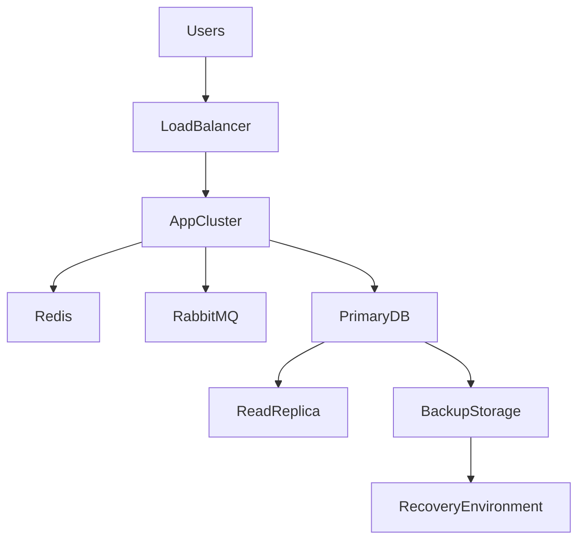
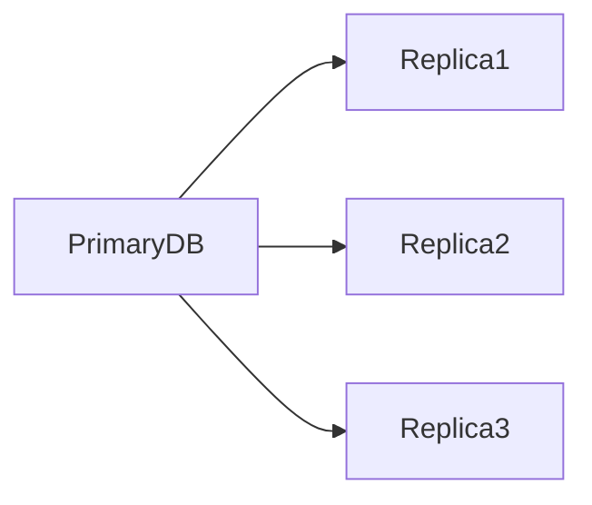
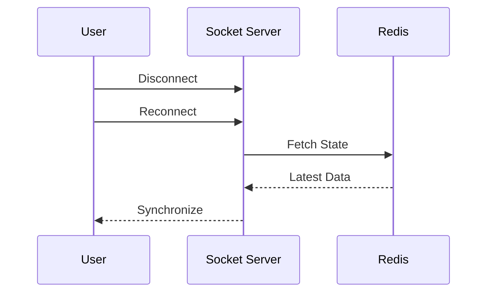

# Disaster Recovery & Business Continuity

## Overview

Sportswiz is designed to provide reliable cricket experiences during live matches, tournaments, and high-traffic sporting events.

Because users rely on realtime score updates and uninterrupted platform availability, disaster recovery planning is considered a critical architectural requirement.

This document outlines the recovery strategies, backup mechanisms, failover procedures, and operational processes used to ensure business continuity.

---

# Objectives

The disaster recovery strategy focuses on:

* Minimize downtime
* Prevent data loss
* Ensure rapid recovery
* Maintain service availability
* Reduce operational impact

---

# Recovery Goals

## Recovery Point Objective (RPO)

Maximum acceptable data loss.

Target:

```text
< 15 Minutes
```

Meaning:

In the worst-case scenario, no more than 15 minutes of data should be lost.

---

## Recovery Time Objective (RTO)

Maximum acceptable downtime.

Target:

```text
< 1 Hour
```

Meaning:

Critical services should be restored within one hour.

---

# Disaster Categories

The platform prepares for multiple failure scenarios.

---

## Application Failure

Examples:

```text
API Crash
Worker Failure
Socket Server Failure
```

Impact:

Partial service degradation.

---

## Database Failure

Examples:

```text
Primary Database Failure
Corrupted Database
Storage Failure
```

Impact:

Critical service disruption.

---

## Cache Failure

Examples:

```text
Redis Crash
Cluster Failure
Memory Exhaustion
```

Impact:

Performance degradation.

---

## Queue Failure

Examples:

```text
RabbitMQ Outage
Message Processing Failure
```

Impact:

Delayed background processing.

---

## Infrastructure Failure

Examples:

```text
Server Failure
Network Failure
Load Balancer Failure
```

Impact:

Service interruption.

---

## Regional Failure

Examples:

```text
AWS Region Outage
Datacenter Failure
```

Impact:

Large-scale disruption.

---

# Recovery Architecture



---

# Application Recovery

Backend services are designed to be stateless.

Benefits:

* Rapid replacement
* Easy scaling
* Faster recovery

---

## Failure Scenario

Example:

```text
API Instance Crash
```

Recovery:

```text
Load Balancer
      ↓
Redirect Traffic
      ↓
Healthy Instance
```

Result:

Minimal user impact.

---

# Database Recovery Strategy

The database is the most critical system component.

---

## Automated Backups

Daily automated backups are enabled.

Backup Contents:

```text
Users
Matches
Statistics
Tournaments
Configurations
```

---

## Backup Retention

Typical retention period:

```text
7 Days
30 Days
90 Days
```

depending on operational requirements.

---

# Point-In-Time Recovery

RDS point-in-time recovery is enabled.

Benefits:

* Restore database to specific timestamp
* Recover from accidental deletions
* Recover from application errors

---

# Database Failover

Architecture:



---

## Failure Scenario

Primary database becomes unavailable.

Recovery Process:

1. Promote replica.
2. Update connection routing.
3. Resume application traffic.

Benefits:

* Reduced downtime
* Faster recovery

---

# Redis Recovery Strategy

Redis primarily stores cached and derived data.

The database remains the source of truth.

---

## Redis Failure

Impact:

```text
Higher Database Load
Temporary Latency Increase
```

Recovery:

```text
Restart Redis
      ↓
Rebuild Cache
      ↓
Resume Normal Operations
```

---

# Redis Persistence

Depending on deployment model:

### Snapshot Persistence

Periodic backups.

### Append Only File

Transaction logging.

Benefits:

* Faster recovery
* Reduced data loss

---

# RabbitMQ Recovery Strategy

RabbitMQ handles asynchronous workloads.

---

## Message Durability

Critical queues are configured as durable.

Benefits:

```text
Messages Survive Restart
```

---

## Persistent Messages

Critical events are stored persistently.

Examples:

```text
score.updated
match.completed
player.stats.updated
```

---

## Failure Scenario

RabbitMQ Node Failure

Recovery:

```text
Restart Service
      ↓
Consumers Resume
      ↓
Processing Continues
```

---

# Realtime System Recovery

Socket.IO supports automatic reconnection.

---

## Client Reconnection Flow



Benefits:

* Better user experience
* Minimal data inconsistency

---

# Infrastructure Recovery

Infrastructure is deployed across multiple availability zones.

Benefits:

* Fault isolation
* Increased resilience

---

## Availability Zone Failure

Recovery Process:

```text
Affected Zone Fails
       ↓
Traffic Redirected
       ↓
Healthy Zones Continue
```

Impact:

Minimal disruption.

---

# Backup Strategy

Multiple backup layers are implemented.

---

## Database Backups

Frequency:

```text
Daily
```

---

## Configuration Backups

Examples:

```text
Environment Configurations
Infrastructure Definitions
Deployment Configurations
```

---

## Asset Backups

Examples:

```text
Player Images
Team Logos
Media Files
```

Stored in durable object storage.

---

# Recovery Testing

Disaster recovery procedures are tested periodically.

Examples:

### Database Restore Test

Verify backup validity.

### Failover Test

Verify replica promotion.

### Service Recovery Test

Verify application restoration.

Benefits:

* Increased confidence
* Reduced recovery risk

---

# Monitoring During Incidents

Critical metrics monitored:

### Availability

```text
Service Health
```

### Data Integrity

```text
Replication Status
```

### Performance

```text
Response Times
```

### Queue Health

```text
Message Backlog
```

---

# Incident Response Process

## Step 1

Detection

Monitoring identifies issue.

---

## Step 2

Assessment

Determine severity and impact.

---

## Step 3

Containment

Prevent further impact.

---

## Step 4

Recovery

Restore affected services.

---

## Step 5

Validation

Confirm normal operations.

---

## Step 6

Postmortem

Document findings and improvements.

---

# Business Continuity Planning

The platform prioritizes continuity for critical operations.

---

## Critical Services

Examples:

```text
Live Match Scoring
Match APIs
Authentication
Tournament Operations
```

These services receive highest recovery priority.

---

# Risk Mitigation Strategies

Several strategies reduce operational risk.

### Redundancy

Multiple service instances.

### Automated Backups

Protect against data loss.

### Monitoring

Rapid issue detection.

### Failover

Automatic service recovery.

### Runbooks

Documented recovery procedures.

---

# Future Improvements

Potential enhancements include:

### Multi-Region Deployment

Geographic redundancy.

---

### Active-Active Architecture

Multiple live regions.

---

### Automated Failover

Reduced manual intervention.

---

### Chaos Engineering

Proactive resilience testing.

---

### Cross-Region Replication

Improved disaster recovery capabilities.

---

# Engineering Outcome

The disaster recovery architecture enables Sportswiz to:

* Maintain operational resilience
* Minimize downtime
* Reduce data loss risk
* Recover rapidly from failures
* Support business continuity

Through backups, redundancy, failover strategies, and operational readiness, the platform remains capable of supporting critical cricket operations even during unexpected infrastructure or application failures.
