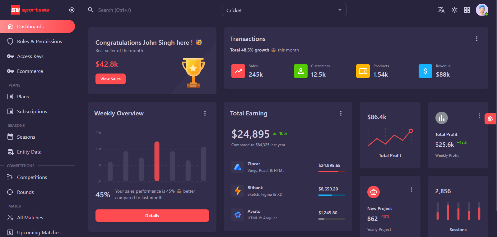

# Admin Dashboard Showcase

## Overview

The administrative platform enables tournament organizers, scorers, and administrators to manage all operational aspects of the cricket ecosystem.

The dashboard serves as the operational control center of Sportswiz.

---

## Admin Dashboard Preview



---

## Core Modules

### Tournament Management

Supports:

* Tournament creation
* Tournament configuration
* Schedule management
* Fixture generation

---

### Match Management

Supports:

* Match creation
* Toss management
* Match status control
* Result management

---

### Team Management

Supports:

* Team registration
* Squad management
* Captain assignment

---

### Player Management

Supports:

* Player profiles
* Statistics management
* Team assignments

---

### Realtime Scoring

Allows scorers to:

* Enter ball events
* Record wickets
* Manage innings
* Update match states

---

## Analytics Dashboard

Provides:

### Match Analytics

```text id="6byd1r"
Live Matches

Completed Matches

Tournament Statistics
```

---

### User Analytics

```text id="vp8j7u"
Active Users

Registrations

Engagement Metrics
```

---

### Infrastructure Analytics

```text id="md4tr4"
API Metrics

Queue Metrics

Realtime Metrics
```

---

## Security Features

Role-based access control.

Supported roles:

```text id="3cljqv"
Super Admin

Tournament Admin

Scorer

Team Manager
```

---

## Engineering Highlights

The dashboard integrates with:

* NestJS APIs
* Redis
* RabbitMQ
* Socket.IO
* MySQL

while supporting production-grade operations and realtime workflows.
