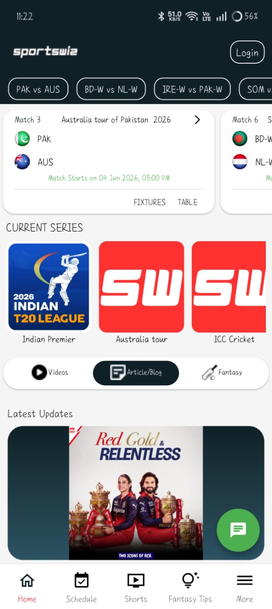

# Mobile Experience

## Overview

A significant percentage of Sportswiz traffic originates from mobile devices.

The platform was designed using a mobile-first mindset to ensure a seamless cricket experience across smartphones and tablets.

---

## Mobile Preview



---

## Mobile Features

### Live Match Tracking

Users can:

* Follow live scores
* View scorecards
* Read commentary
* Track statistics

---

### Realtime Updates

Powered by:

* Socket.IO
* Redis Pub/Sub

Benefits:

```text id="9u5oyq"
Instant Updates

Minimal Refresh Requirements
```

---

### Tournament Coverage

Users can access:

* Fixtures
* Points Tables
* Results
* Rankings

---

### Player Profiles

Includes:

* Career Statistics
* Match Performance
* Historical Records

---

## Mobile Performance Strategy

Several optimizations improve user experience.

### Asset Optimization

* Compressed images
* Lazy loading
* CDN delivery

---

### API Optimization

* Cached responses
* Pagination
* Reduced payload sizes

---

### Realtime Optimization

* Room-based subscriptions
* Lightweight event payloads
* Connection recovery

---

## Engineering Goals

Target mobile metrics:

```text id="almsz5"
First Contentful Paint < 2 Seconds

Realtime Latency < 500ms

Responsive Across Devices
```

---

## Technology Stack

Mobile experiences leverage:

* Next.js
* NestJS
* Redis
* RabbitMQ
* Socket.IO
* AWS Infrastructure

---

## Outcome

The mobile platform provides users with a responsive, low-latency cricket experience while maintaining consistency with desktop and administrative workflows.
