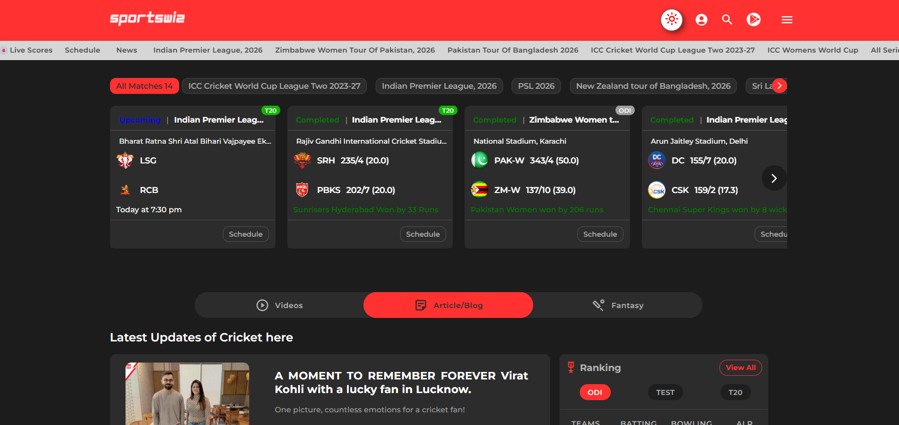

# Platform Showcase

## Homepage Experience

The Sportswiz platform homepage was designed to provide users with quick access to live matches, tournaments, player statistics, rankings, and cricket insights.

---

## Key Features

### Live Match Center

Provides:

* Live scores
* Match status
* Team information
* Match summaries

---

### Tournament Coverage

Users can explore:

* Ongoing tournaments
* Upcoming fixtures
* Points tables
* Match schedules

---

### Player Statistics

Access to:

* Batting records
* Bowling records
* Rankings
* Career statistics

---

## Homepage Preview



---

## Engineering Considerations

The homepage was optimized for:

### Performance

* CDN delivery
* Optimized assets
* Lazy loading

### Scalability

* Cache-first architecture
* Redis-powered APIs

### User Experience

* Fast loading
* Mobile responsiveness
* Realtime updates

---

## Technology Integration

The homepage integrates with:

* Next.js Frontend
* NestJS APIs
* Redis Cache
* RabbitMQ Events
* Socket.IO Realtime Services

---

## Performance Goals

Target metrics:

```text id="zvax9h"
Initial Load < 2 Seconds

Largest Contentful Paint < 2.5 Seconds

Realtime Updates < 1 Second
```

---

## Related Screens

* Match Center
* Admin Dashboard
* Mobile Experience
